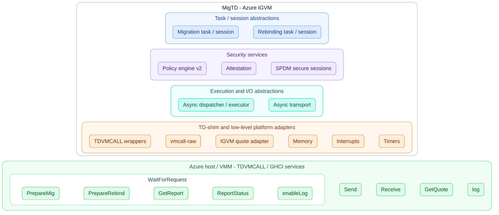
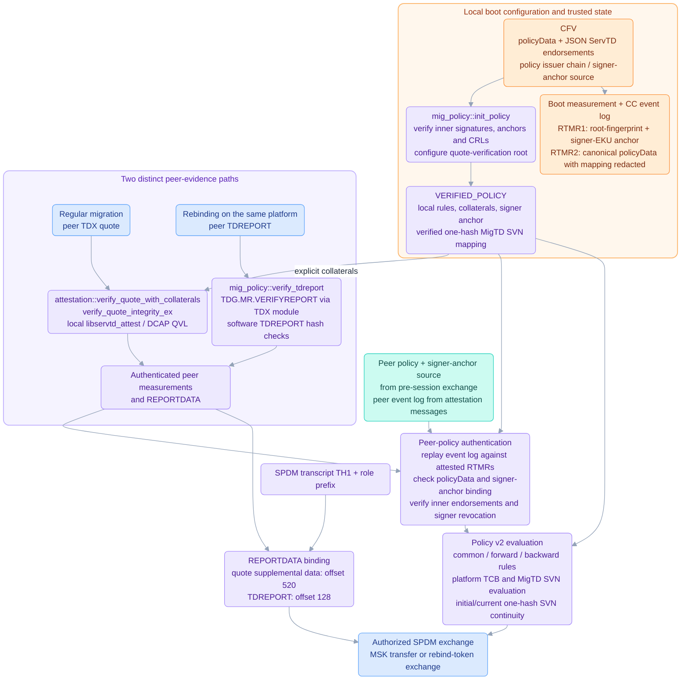
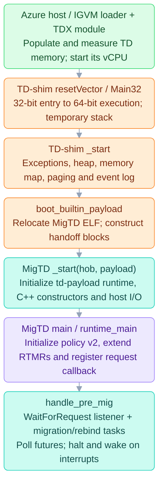

# MigTD Architecture Overview (Azure Build)

Source baseline: MigTD commit `7ffd8d940d1f5c9749e6b203d8ebd013848e3839`
(`ms/integration`). The diagrams describe the following effective feature
set, with Cargo/xtask defaults disabled:

```text
vmcall-raw,stack-guard,main,vmcall-interrupt,oneshot-apic,
spdm_attestation,igvm-attest,policy_v2
```

The image format is **IGVM**. `igvm-attest` selects a quote-acquisition
interface; it does not select the image format.

## Build scope

| Feature | Architectural effect |
|---|---|
| `main` | Firmware executable, attestation dependency, and policy logging support |
| `vmcall-raw` | GHCI host control and `VmcallRaw` peer transport over shared memory |
| `vmcall-interrupt` | Interrupt-assisted completion of host service requests |
| `oneshot-apic` | APIC one-shot fallback when TSC-deadline mode is unavailable; does not force one-shot mode on every platform |
| `stack-guard` | `td-payload` stack guard page and page-fault exception stack, not a stack canary |
| `spdm_attestation` | SPDM requester/responder and secured migration/rebind exchange instead of the RA-TLS session path |
| `igvm-attest` | `get_quote_igvm()` / `servtd_get_quote()` host-mediated quote acquisition |
| `policy_v2` | `policy::v2`, `mig_policy::v2`, and `attestation/attest-lib-ext`; also enables the vmcall-raw rebind and `GetMigtdData` handlers |

This exact profile uses **JSON ServTD endorsements**. Signed CoRIM
endorsements require the additional `servtd_corim` feature and enrollment;
`policy_v2` alone does not enable them. See
[Policy v2 Generation Workflow](policy-v2-workflow.md) for that alternative.

## What MigTD is

A single-core, single-threaded `no_std` Rust TDX **Service TD**
(`SERVTD_TYPE = 0`) that mutually remote-attests a migration source
(MigTD-S) and destination (MigTD-D) over
**SPDM**, evaluates both against **policy v2**, and exchanges the **Migration
Session Key (MSK)** so the VMM can live-migrate a user TD. It also prepares
rebinding from an old MigTD to a new MigTD on the same platform. MigTD
authorizes these operations; it does not carry the user TD's migrated
memory pages over its SPDM channel.

The firmware stack, bottom-up, is **TD-shim boot -> td-payload runtime ->
MigTD dispatcher/services -> migration, SPDM, attestation, and policy**.
TD-shim is the lowest firmware layer, not a guest operating system.

## Layered abstraction view

Conceptual host-facing layers, from application abstractions at the top to
host primitives at the bottom. Each group has an enclosing box, with its
components in separate sibling boxes. This is not a call graph; no
interaction arrows are shown.



The platform layer groups TD-shim with MigTD-specific raw-I/O and quote
adapters; it does not imply that all those adapters live in TD-shim.
`PrepareMig`, `PrepareRebind`, and `GetReport` are conceptual labels for
the `StartMigration`, `StartRebinding`, and `GetTdReport` WFR requests.
`ReportStatus` is grouped with WFR as the completion side of the request
lifecycle; it remains a separate GHCI primitive.
The diagram uses compact spacing, light layer-specific colors, and rounded
borders for every group.
Invisible Mermaid links only arrange layers vertically and sibling
components horizontally; they do not represent interactions.

## Static component structure

Solid arrows show component use or a labeled interface. Dashed arrows
show boot handoff, shared runtime support, or interrupt notification, not
additional threads. The runtime foundation supports all payload components;
not every low-level dependency is drawn.

```mermaid
%%{init: {
    "theme": "base",
    "themeVariables": {
        "fontFamily": "Segoe UI, Arial, sans-serif",
        "fontSize": "14px",
        "background": "#ffffff",
        "primaryColor": "#ffffff",
        "primaryTextColor": "#1e293b",
        "primaryBorderColor": "#cbd5e1",
        "clusterBkg": "#f8fafc",
        "clusterBorder": "#cbd5e1",
        "edgeLabelBackground": "#ffffff",
        "lineColor": "#94a3b8"
    },
    "flowchart": {
        "nodeSpacing": 8,
        "rankSpacing": 14,
        "padding": 6,
        "diagramPadding": 6,
        "subGraphTitleMargin": {"top": 4, "bottom": 16}
    }
}}%%
flowchart TB
    subgraph TD["MigTD Service TD - Azure IGVM"]
        subgraph APP["MigTD payload - application and security"]
            DISPATCH["Startup + cooperative dispatcher<br/>main.rs / async_runtime<br/>request listener + up to 12 request tasks"]
            SESSION["Migration and rebind orchestration<br/>session.rs / rebinding.rs / servtd_ext.rs<br/>MSK, version, binding state and tokens"]
            SPDM["SPDM requester / responder<br/>spdm-rs + MigTD vendor messages<br/>TH1 binding and secured exchange"]
            POLICY["Policy v2<br/>mig_policy.rs + policy::v2<br/>VERIFIED_POLICY and peer evaluation"]
            ATTEST["Attestation<br/>TDREPORT / IGVM quote acquisition<br/>local ServTD DCAP/QVL verification"]
            MEASURE["Configuration + event log<br/>CFV inputs, RTMR measurements<br/>peer event-log replay"]
            CRYPTO["Rust crypto support<br/>crypto crate + ring<br/>hashes, signatures, certificates"]
        end

        subgraph IO["Host and peer interfaces"]
            CONTROL["GHCI control plane<br/>WaitForRequest / ReportStatus"]
            PRE["Pre-session exchange<br/>policy + signer-anchor source<br/>untrusted until authenticated"]
            SPDMIO["SPDM I/O adapter<br/>MigtdTransport / SpdmDeviceIo"]
            DATA["Peer data plane<br/>VmcallRaw async stream<br/>shared Send / Receive buffers"]
            LOG["Diagnostics<br/>shared log area / crash MSRs"]
        end

        subgraph BASE["TD-shim foundation - lowest firmware layer"]
            SHIM["TD-shim boot<br/>reset vector, loader, HOB handoff"]
            RUNTIME["td-payload runtime<br/>paging, heap, stack guard page<br/>shared memory, IDT and APIC"]
            IRQ["Interrupts and timeout futures<br/>0x50 control / 0x52 data<br/>TSC-deadline or one-shot fallback"]
            TDCALL["tdx-tdcall<br/>TDREPORT / VERIFYREPORT / RTMR<br/>Service-TD metadata operations"]
        end
    end

    subgraph HOST["Azure host / VMM - untrusted"]
        HCTRL["Migration orchestration service"]
        HDATA["Send / Receive relay"]
        HQUOTE["Quote service"]
        HLOG["Log / crash collector"]
    end
    PEER["Peer MigTD<br/>migration destination/source<br/>or new/old MigTD for rebind"]
    MODULE["TDX module / CPU<br/>attested measurements and reports<br/>user-TD migration/binding metadata"]

    DISPATCH --> SESSION
    DISPATCH --> CONTROL
    DISPATCH --> MEASURE
    DISPATCH --> POLICY
    DISPATCH --> LOG
    SESSION --> PRE
    SESSION --> SPDM
    SESSION --> TDCALL
    PRE --> DATA
    SPDM --> SPDMIO --> DATA
    SPDM --> POLICY
    SPDM --> ATTEST
    SPDM --> CRYPTO
    POLICY --> ATTEST
    POLICY --> MEASURE
    POLICY --> CRYPTO
    MEASURE --> TDCALL
    ATTEST --> TDCALL
    TDCALL --> MODULE

    SHIM -. "handoff to MigTD _start" .-> DISPATCH
    RUNTIME -. "payload support" .-> DISPATCH
    IRQ --> RUNTIME
    IRQ -. "completion flags / timer wakeups" .-> DISPATCH
    HCTRL -. "0x50" .-> IRQ
    HDATA -. "0x52" .-> IRQ
    CONTROL <-->|"GHCI requests / responses"| HCTRL
    DATA <-->|"GHCI Send / Receive"| HDATA
    HDATA <-->|"relayed peer bytes"| PEER
    ATTEST <-->|"servtd_get_quote / quote buffer"| HQUOTE
    LOG --> HLOG

    classDef task fill:#dbeafe,stroke:#60a5fa,color:#1e3a8a,stroke-width:1px,rx:6px,ry:6px
    classDef security fill:#ede9fe,stroke:#a78bfa,color:#4c1d95,stroke-width:1px,rx:6px,ry:6px
    classDef runtime fill:#ccfbf1,stroke:#2dd4bf,color:#134e4a,stroke-width:1px,rx:6px,ry:6px
    classDef platform fill:#ffedd5,stroke:#fb923c,color:#7c2d12,stroke-width:1px,rx:6px,ry:6px
    classDef host fill:#dcfce7,stroke:#4ade80,color:#14532d,stroke-width:1px,rx:6px,ry:6px

    class SESSION,PEER task
    class SPDM,POLICY,ATTEST,CRYPTO security
    class DISPATCH,PRE,SPDMIO,DATA runtime
    class MEASURE,CONTROL,LOG,SHIM,RUNTIME,IRQ,TDCALL,MODULE platform
    class HCTRL,HDATA,HQUOTE,HLOG host

    style TD fill:#ffffff,stroke:#cbd5e1,color:#0f172a,stroke-width:1.5px,rx:12px,ry:12px
    style APP fill:#eff6ff,stroke:#93c5fd,color:#1e40af,stroke-width:1.5px,rx:10px,ry:10px
    style IO fill:#f0fdfa,stroke:#5eead4,color:#115e59,stroke-width:1.5px,rx:10px,ry:10px
    style BASE fill:#fff7ed,stroke:#fdba74,color:#9a3412,stroke-width:1.5px,rx:10px,ry:10px
    style HOST fill:#f0fdf4,stroke:#86efac,color:#166534,stroke-width:1.5px,rx:12px,ry:12px
```



The GHCI control/data interfaces use TDVMCALL wrappers and shared memory;
the TDX-module interface uses TDCALL operations. These are distinct trust
boundaries. The VMM can relay, modify, delay, or drop transport data, but is
not trusted to authenticate a peer or authorize an MSK transfer.

With `policy_v2`, the dispatcher enables **`StartRebinding` and
`GetMigtdData`** in addition to `StartMigration`, `GetTdReport`, and
`EnableLogArea`. One listener accepts requests; per-request futures share
the same cooperative executor. Interrupt callbacks
record completion state, and the main loop polls tasks then halts until an
interrupt. A broadcast data wakeup is filtered by each request's shared-buffer
`data_status`.

## Policy v2 and attestation structure

Policy v2 is not just a replacement policy file. It connects measured
configuration, authenticated collateral, peer evidence, and SPDM channel
binding. The following diagram shows those dependencies, not a strict
sequence of calls.



**Boot trust.** `init_policy()` freezes the verified local policy.
`do_measurements()` measures the signer anchor and canonical policy data
before request handling begins. RTMR1 binds the root-certificate fingerprint
and enrolled signer-purpose EKU, not the complete PEM chain or an individual
leaf key. For this JSON profile, RTMR2 excludes only the ServTD TCB mapping
and its issuer chain; the rest of `policyData`, including any TD Identity
and its issuer chain, remains measured. The legacy outer policy signature
is ignored; inner endorsement signatures and measurement binding are
load-bearing. The quote-verification root comes from policy-v2 collaterals,
not the separate policy-v1 root-CA enrollment slot.

**Peer trust.** Policy material received before SPDM authentication is not
trusted merely because it arrived over `VmcallRaw`. Quote/TDREPORT verification
authenticates measurements; event-log replay and policy checks bind the
received policy and signer anchor to those measurements. The authenticated
peer signer anchor must match the local one. SPDM then checks the appropriate
REPORTDATA binding to TH1 before the secured MSK or rebind-token exchange.

**Migration versus rebind.** Regular migration verifies the peer quote
through the in-image C/C++ ServTD verifier using explicit policy collaterals.
Rebinding verifies the peer's TDREPORT using the TDX module and the
TDREPORT-specific binding helper. These paths must not be conflated.
Rebind policy evaluation still calls `get_local_tcb_evaluation_info()` for
a local reference; that helper obtains and verifies a **local quote**.
Thus, peer rebind evidence is quote-free, but the complete rebind operation
is not necessarily free of quote-service/QVL calls.

Measurement details:
[Boot Measurements](boot-measurements.md),
[TCB Mapping Design](../../doc/tcb_mapping_design_proposal.md), and
[`policy::v2::measurement`](../../src/policy/src/v2/measurement.rs).
Continuity details:
[Init_TDINFO and ServtdExt Usage Summary](init-tdinfo-servtd-ext.md).

## IGVM build and image composition

`cargo image` resolves through `.cargo/config.toml` to `xtask image`.
`xtask/src/build.rs::build()` builds the shim and payload, links an IGVM
image, then enrolls configuration into its CFV.

```mermaid
%%{init: {
    "theme": "base",
    "themeVariables": {
        "fontFamily": "Segoe UI, Arial, sans-serif",
        "fontSize": "14px",
        "background": "#ffffff",
        "primaryColor": "#ffffff",
        "primaryTextColor": "#1e293b",
        "primaryBorderColor": "#cbd5e1",
        "clusterBkg": "#f8fafc",
        "clusterBorder": "#cbd5e1",
        "edgeLabelBackground": "#ffffff",
        "lineColor": "#94a3b8"
    },
    "flowchart": {
        "nodeSpacing": 8,
        "rankSpacing": 14,
        "padding": 6,
        "diagramPadding": 6,
        "subGraphTitleMargin": {"top": 4, "bottom": 16}
    }
}}%%
flowchart LR
    CMD["cargo image / xtask"]
    LAYOUT["Memory + image layout<br/>IGVM metadata"]
    SHIM["TD-shim build<br/>ResetVector.bin + td-shim"]
    PAYLOAD["MigTD build<br/>x86_64-unknown-none ELF<br/>specified features + policy_v2"]
    ATTESTBUILD["attestation/build.rs<br/>linux-sgx preparation + make servtd_attest<br/>libservtd_attest.a, DCAP/QVL + SgxSSL"]
    LINK["td-shim-ld -i igvm"]
    INITIAL["Linked IGVM image"]
    CONFIG["policy-v2 policyData / collaterals<br/>JSON ServTD endorsements<br/>policy issuer chain"]
    ENROLL["td-shim-enroll<br/>populate configuration firmware volume"]
    IMAGE["Final migtd.igvm<br/>TD-shim + statically linked MigTD payload<br/>CFV + IGVM launch directives"]
    LOAD["Host IGVM loader / TDX module<br/>launch measurements into MRTD<br/>then execute TD-shim"]

    CMD --> SHIM
    CMD --> PAYLOAD
    LAYOUT --> SHIM
    LAYOUT --> LINK
    ATTESTBUILD -->|"static link"| PAYLOAD
    SHIM --> LINK
    PAYLOAD --> LINK
    LINK --> INITIAL --> ENROLL
    CONFIG --> ENROLL
    ENROLL --> IMAGE --> LOAD

    classDef task fill:#dbeafe,stroke:#60a5fa,color:#1e3a8a,stroke-width:1px,rx:6px,ry:6px
    classDef security fill:#ede9fe,stroke:#a78bfa,color:#4c1d95,stroke-width:1px,rx:6px,ry:6px
    classDef runtime fill:#ccfbf1,stroke:#2dd4bf,color:#134e4a,stroke-width:1px,rx:6px,ry:6px
    classDef platform fill:#ffedd5,stroke:#fb923c,color:#7c2d12,stroke-width:1px,rx:6px,ry:6px
    classDef host fill:#dcfce7,stroke:#4ade80,color:#14532d,stroke-width:1px,rx:6px,ry:6px

    class PAYLOAD,INITIAL,IMAGE task
    class ATTESTBUILD,CONFIG security
    class CMD runtime
    class LAYOUT,SHIM,LINK,ENROLL platform
    class LOAD host
```



The quote verifier is linked into the MigTD payload, not deployed as a
separate host verifier or guest process. Quote **generation** still calls
the external quote service. At launch, image metadata controls MRTD
measurement; the CFV configuration is bound later through MigTD's RTMR1/2
measurements rather than treating the entire CFV as measured code.

For this JSON-endorsement profile, use the image builder's `--policy-v2`
option as well as the requested image format:

```bash
cargo image --no-default-features --image-format igvm \
  --features vmcall-raw,stack-guard,main,vmcall-interrupt,oneshot-apic,spdm_attestation,igvm-attest \
  --policy-v2 \
  --policy /path/to/policy_v2.json \
  --policy-issuer-chain /path/to/policy_issuer_chain.pem \
  --output target/migtd.igvm
```

`--policy-v2` adds the Cargo `policy_v2` feature **and** selects v2 argument
validation and enrollment. Merely putting `policy_v2` in `--features`
does not set the xtask enrollment option. `--no-default-features` prevents
xtask from adding its default `virtio-vsock` transport. The example uses
placeholder paths: the policy must contain deployable signed endorsements,
not a static test/template mapping.

## Azure boot sequence: without a guest kernel

**MigTD is bootable firmware, not a process that needs Linux or Windows
inside its TD.** The host creates the TD and starts its virtual CPU at the
firmware entry point. TD-shim bootstraps the execution environment and
loads MigTD directly. The MigTD executable contains the runtime libraries
it needs, including `td-payload`, the cooperative executor, transport,
crypto, and the statically linked ServTD attestation library.

The host still has its own virtualization stack. "Without a kernel" means
**without a guest OS kernel inside MigTD**, not without a host/VMM or TDX
module. The TDX module enforces TD isolation and provides TDX operations;
it is not a Linux/Windows-style guest kernel.

### Boot order



1. **The host launches the IGVM image.** The image already contains the
   TD-shim boot firmware volume (BFV), MigTD payload, configuration firmware
   volume (CFV), and page-placement/measurement directives. The host and
   TDX module establish TD memory, finalize launch measurements, and start
   the TD vCPU; there is no guest disk boot or root filesystem to load.
   The Azure host implementation is outside this repository: this step is
   the launch contract, while the following steps are traced in firmware
   source. See
   [`TdShimLinker::build_igvm`](../../deps/td-shim/td-shim-tools/src/linker.rs#L424-L621)
   and [Boot Measurements](boot-measurements.md).

2. **Reset-vector assembly makes Rust execution possible.** The
   [`resetVector`](../../deps/td-shim/td-shim/ResetVector/Ia32/ResetVectorVtf0.asm#L43-L51)
   jumps to
   [`Main32`](../../deps/td-shim/td-shim/ResetVector/Main.asm#L44-L230).
   This is a **32-bit TDX firmware entry**, not a legacy 16-bit PC boot
   sequence. It reloads flat segments, enables paging and transitions to
   64-bit execution, establishes a temporary stack, copies the TD-shim
   initialization code to its execution address at 1 MiB, and calls the
   shim's Rust entry. The linker has already relocated that shim code for
   this address. See also
   [`Transition32FlatTo64Flat`](../../deps/td-shim/td-shim/ResetVector/Ia32/Flat32ToFlat64.asm#L15-L34).

3. **TD-shim initializes the firmware environment.** Its
   [`_start`](../../deps/td-shim/td-shim/src/bin/td-shim/main.rs#L84-L161)
   installs exception handling, initializes its heap, reads image metadata,
   constructs the memory map, accepts runtime memory as needed, sets up
   paging, and creates the event log and ACPI handoff data. No OS services
   are involved.

4. **TD-shim loads MigTD as an executable payload.**
   [`boot_builtin_payload`](../../deps/td-shim/td-shim/src/bin/td-shim/main.rs#L210-L290)
   extracts the executable from the payload firmware volume.
   [`ipl::find_and_report_entry_point`](../../deps/td-shim/td-shim/src/bin/td-shim/ipl.rs#L36-L80)
   recognizes the ELF and relocates it into runtime memory. The shim builds
   a HOB (handoff-block) list containing the memory map and ACPI data, then
   calls the ELF entry using the System V x86-64 ABI:
   **`MigTD::_start(hob_address, loaded_payload_address)`**. The shim's
   `_start` and MigTD's `_start` are different entry points in different
   executable images.

5. **MigTD establishes its own linked runtime.**
   [`src/migtd/src/lib.rs::_start`](../../src/migtd/src/lib.rs#L70-L149)
   calls `td_payload::arch::init::pre_init` to consume the HOB, establish
   payload paging, heap and shared-memory pools, and initialize GDT/IDT
   and APIC support. It initializes the C attestation heap, explicitly runs
   ELF `.init_array` constructors, and initializes crash reporting,
   timers, `vmcall-raw`, and system ticks. Finally,
   [`td_payload::arch::init::init`](../../deps/td-shim/td-payload/src/arch/x86_64/init.rs#L69-L107)
   allocates the runtime stack, installs its guard page, switches stacks,
   and calls MigTD `main`. These are library calls inside the firmware,
   not requests to an external kernel.

6. **MigTD initializes policy before accepting work.**
   [`main` / `runtime_main`](../../src/migtd/src/bin/migtd/main.rs#L82-L170)
   sets up host logging and calls `do_measurements`. In the policy-v2 path,
   it measures the signer anchor into RTMR1, initializes/verifies
   `VERIFIED_POLICY` and the quote-verification root, then extends canonical
   policy data into RTMR2. It registers the host request-completion
   callback and enters the dispatcher. The earlier
   [policy-v2 section](#policy-v2-and-attestation-structure) describes
   exactly what is measured.

7. **The firmware remains in its request loop.**
   [`handle_pre_mig`](../../src/migtd/src/bin/migtd/main.rs#L469-L673)
   runs a `WaitForRequest` listener and per-request futures on the
   single-threaded executor. It polls work, then uses the APIC
   `enable_and_hlt` path to wait for an interrupt. Migration and rebind
   sessions start in response to host requests; there is no userspace
   process startup or OS thread scheduler.

### Why the optional Linux boot code is not used

TD-shim supports several payload types, but its capabilities do not imply
that MigTD boots Linux. For the metadata used by this build,
[`config/metadata.json`](../../config/metadata.json) supplies `PermMem`
and a built-in `Payload` section, with **no `TdHob` section**.
[`BootTimeDynamic::new`](../../deps/td-shim/td-shim/src/bin/td-shim/shim_info.rs#L133-L169)
therefore sets `payload_info` to `None`.
The conditional `boot_linux_kernel(...)` call in the shim is bypassed;
execution proceeds to `boot_builtin_payload(...)`.

The later **payload HOB** is generated by TD-shim for MigTD's handoff; it
is distinct from an optional **input TD HOB** carrying Linux payload
information. Likewise, UEFI PI firmware-volume/section names are container
formats, not proof of an OS or a PE executable: the Azure MigTD build
produces an ELF for `x86_64-unknown-none`, and the payload loader detects
its actual format. See
[`xtask::build_shim` / `build_migtd`](../../xtask/src/build.rs#L260-L352).

### What supplies the facilities normally provided by a kernel

| Facility | MigTD implementation |
|---|---|
| Executable loading and initial CPU setup | TD-shim reset-vector assembly and built-in ELF loader |
| Memory allocation, paging, stack and shared buffers | Linked `td-payload` runtime and TD-shim memory support |
| Exceptions, interrupts and timeouts | GDT/IDT/APIC support plus MigTD timer/tick drivers |
| Task scheduling | MigTD's cooperative `async_runtime`, not OS threads |
| Host and peer I/O | GHCI TDVMCALL adapters and shared-memory `VmcallRaw`, not kernel sockets |
| Rust and C/C++ runtime needs | `no_std` Rust with `core`/`alloc`, statically linked libraries, explicit heap/constructor initialization |

TD-shim's loader hands control to MigTD; it is not a resident kernel that
MigTD calls for every operation. The reusable `td-payload`/TDX libraries
remain linked into the payload. No guest kernel, initrd, shell, root
filesystem, dynamic linker, or general-purpose OS network stack is needed.

This trace uses TD-shim commit
`fb220373cc281429364fdefde616838c4c34e136`, pinned by the MigTD source
baseline above.

## Main components and source anchors

| Component | Responsibility and source |
|---|---|
| Feature selection | [`src/migtd/Cargo.toml`](../../src/migtd/Cargo.toml), especially `policy_v2`, `spdm_attestation`, and transport features |
| TD-shim / payload startup | [`lib.rs::_start`](../../src/migtd/src/lib.rs); [`td-payload::arch::init`](../../deps/td-shim/td-payload/src/arch/x86_64/init.rs) supplies memory and stack guard setup |
| Dispatcher | [`main.rs::runtime_main`, `handle_pre_mig`](../../src/migtd/src/bin/migtd/main.rs); [`async_runtime`](../../src/async/async_runtime/src/lib.rs) |
| Interrupts / timers | [`migration/event.rs`](../../src/migtd/src/migration/event.rs), [`driver/timer.rs`](../../src/migtd/src/driver/timer.rs), [`driver/ticks.rs`](../../src/migtd/src/driver/ticks.rs) |
| Host control / MSK operations | [`session.rs::wait_for_request`, `report_status`, `exchange_msk`](../../src/migtd/src/migration/session.rs); [`servtd_ext.rs`](../../src/migtd/src/migration/servtd_ext.rs) |
| Rebinding | [`rebinding.rs::start_rebinding`](../../src/migtd/src/migration/rebinding.rs); [`spdm_rebind.rs`](../../src/migtd/src/spdm/spdm_rebind.rs) |
| Pre-session policy exchange | [`pre_session_data.rs::pre_session_data_exchange`](../../src/migtd/src/migration/pre_session_data.rs) |
| SPDM / channel binding | [`spdm/mod.rs::MigtdTransport`, `verify_report_data_binding`, `verify_tdreport_data_binding`](../../src/migtd/src/spdm/mod.rs); [`spdm_req.rs`](../../src/migtd/src/spdm/spdm_req.rs), [`spdm_rsp.rs`](../../src/migtd/src/spdm/spdm_rsp.rs); [`spdm_session.rs`](../../src/migtd/src/migration/spdm_session.rs) handles timeout and transport teardown |
| Peer data transport | [`migration/transport.rs`](../../src/migtd/src/migration/transport.rs) selects [`VmcallRaw`](../../src/devices/vmcall_raw/src/stream.rs); [`transport/vmcall.rs`](../../src/devices/vmcall_raw/src/transport/vmcall.rs) implements GHCI Send/Receive |
| Attestation | [`igvmattest.rs::get_quote_igvm`](../../src/attestation/src/igvmattest.rs), [`attest.rs::verify_quote_with_collaterals`](../../src/attestation/src/attest.rs); [`attestation/build.rs`](../../src/attestation/build.rs) selects and links ServTD verification |
| Policy / measured configuration | [`mig_policy.rs::init_policy`, `authenticate_remote`, `authenticate_rebinding_common`](../../src/migtd/src/mig_policy.rs); [`policy::v2::policy`](../../src/policy/src/v2/policy.rs), [`config.rs`](../../src/migtd/src/config.rs), [`event_log.rs`](../../src/migtd/src/event_log.rs) |
| Crypto | [`src/crypto`](../../src/crypto) supplies hashing, ECDSA P-384, and certificate/CRL handling; SPDM also uses ring, while the C verifier links its own SgxSSL crypto |
| Image build / enrollment | [`xtask/src/build.rs::build`, `features`, `build_final`, `enroll`](../../xtask/src/build.rs) |
| Offline policy / hash tools | [`migtd-policy-generator`](../../tools/migtd-policy-generator), [`migtd-hash`](../../tools/migtd-hash); [Policy v2 Generation Workflow](policy-v2-workflow.md) |

For a broader narrative, see
[MigTD Functionality Summary](../../doc/MigTD_Functionality_Summary.md).
The separate emulation profile is covered by
[AzCVMEmu Build & Run](azcvmemu-build-and-run.md).

## Migration error codes (host-visible) — quick lookup

| Code | Cause |
|:----:|-------|
| 1 | VMM-provided data not as expected |
| 3 | Out of memory |
| 4 | TDX module error (often mismatched `SERVTD_INFO_HASH`) |
| 5 | Failed to establish host communication channel |
| 6 | SPDM/secure-session error (remote quote verification or handshake aborted) |
| 7 | Unable to obtain the quote |
| 8 | Remote quote does not satisfy the migration policy |

## Explicitly out of scope of the Azure-focused doc

The active RA-TLS session path, virtio/vsock transports, TDVF (`.bin`)
packaging, AzCVMEmu, and test-only attestation bypasses are not part of this
profile. This does not mean every supporting dependency is absent:
`virtio`, `pci`, and the default `crypto`/rustls dependencies remain in the
crate graph. CoRIM is an additional policy-v2 profile, not implicitly enabled.
See
[doc/MigTD_Functionality_Summary.md](../../doc/MigTD_Functionality_Summary.md)
and [Policy v2 Generation Workflow](policy-v2-workflow.md) for other profiles.
