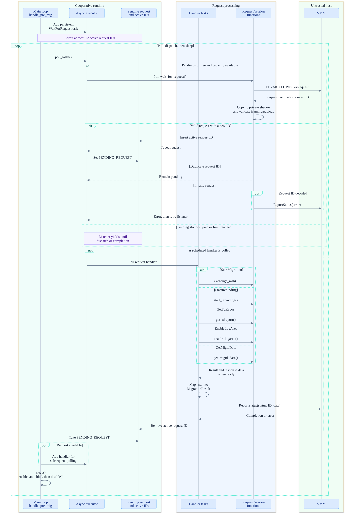
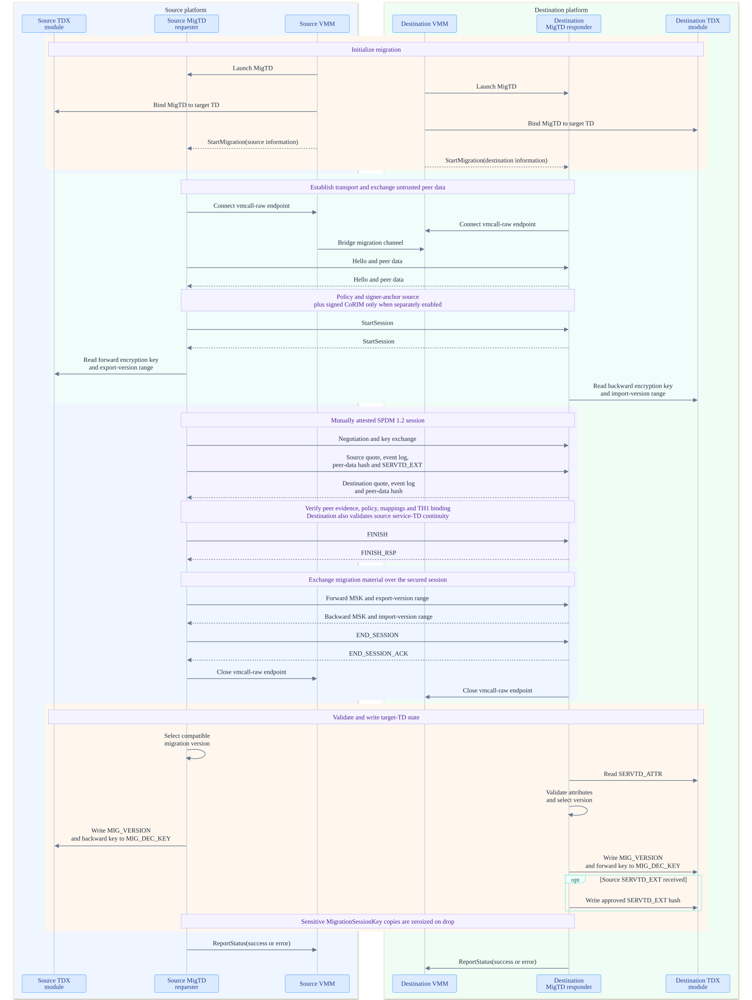
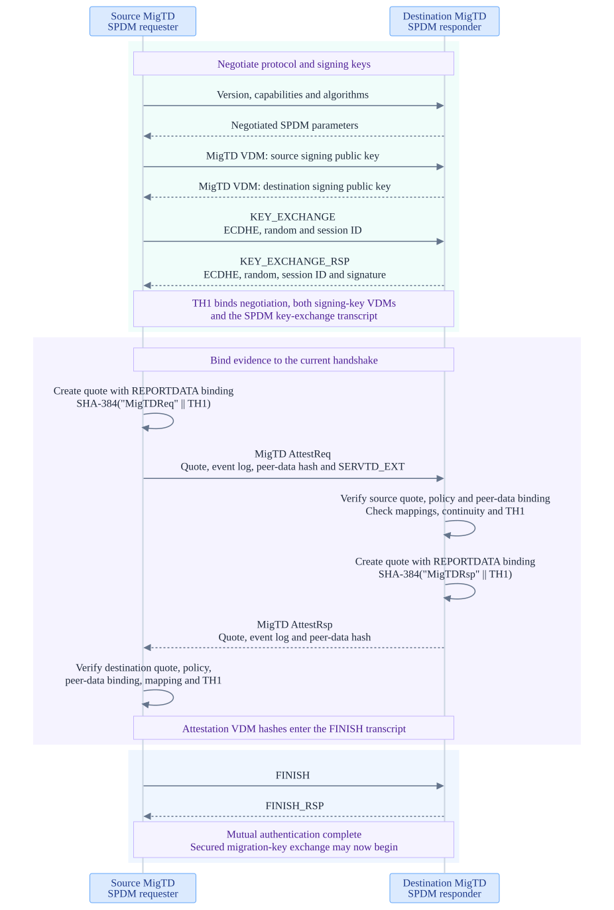
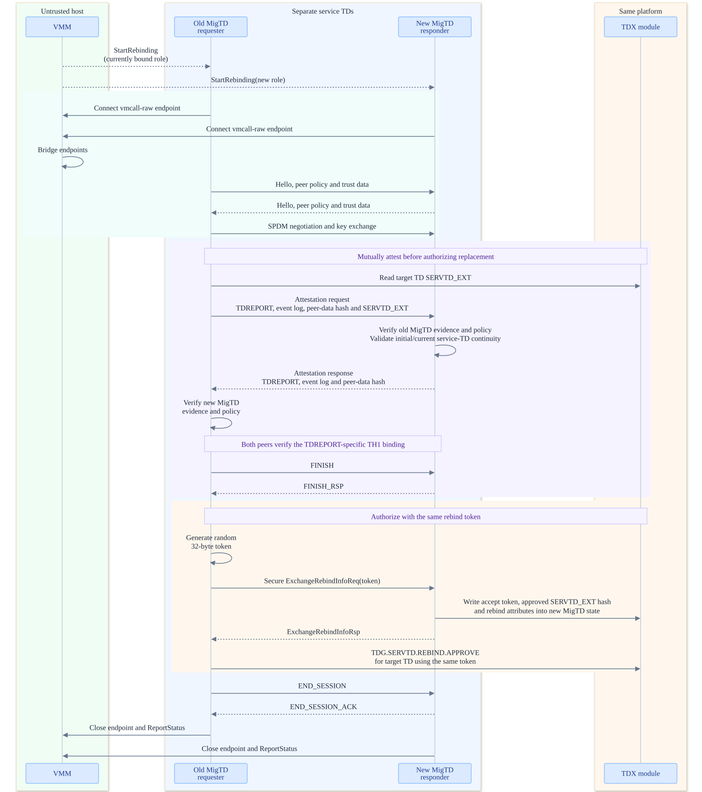
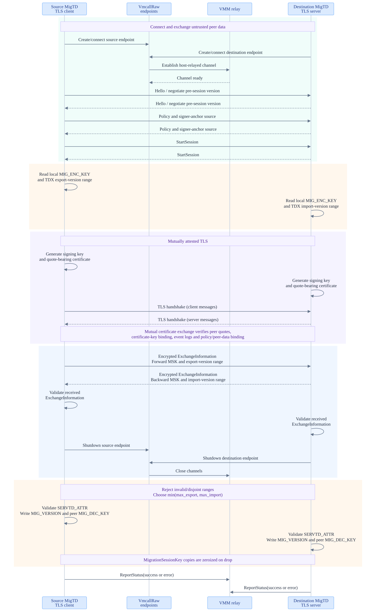

# MigTD Architecture Overview (Azure Build)

Source baseline: MigTD commit `7ffd8d940d1f5c9749e6b203d8ebd013848e3839`
(`ms/integration`). Unless explicitly marked as an alternate profile, the
diagrams describe the following effective feature set, with Cargo/xtask
defaults disabled:

```text
vmcall-raw,stack-guard,main,vmcall-interrupt,oneshot-apic,
spdm_attestation,igvm-attest,policy_v2
```

The image format is **IGVM**. `igvm-attest` selects a quote-acquisition
interface; it does not select the image format.

## Build scope

| Feature | Architectural effect |
|---|---|
| `main` | Firmware executable, attestation dependency, and policy logging support |
| `vmcall-raw` | GHCI host control and `VmcallRaw` peer transport over shared memory |
| `vmcall-interrupt` | Interrupt-assisted completion of host service requests |
| `oneshot-apic` | APIC one-shot fallback when TSC-deadline mode is unavailable; does not force one-shot mode on every platform |
| `stack-guard` | `td-payload` stack guard page and page-fault exception stack, not a stack canary |
| `spdm_attestation` | SPDM requester/responder and secured migration/rebind exchange instead of the RA-TLS session path |
| `igvm-attest` | `get_quote_igvm()` / `servtd_get_quote()` host-mediated quote acquisition |
| `policy_v2` | `policy::v2`, `mig_policy::v2`, and `attestation/attest-lib-ext`; also enables the vmcall-raw rebind and `GetMigtdData` handlers |

This exact profile uses **JSON ServTD endorsements**. Signed CoRIM
endorsements require the additional `servtd_corim` feature and enrollment;
`policy_v2` alone does not enable them. See
[Policy v2 Generation Workflow](policy-v2-workflow.md) for that alternative.

## What MigTD is

A single-core, single-threaded `no_std` Rust TDX **Service TD**
(`SERVTD_TYPE = 0`) that mutually remote-attests a migration source
(MigTD-S) and destination (MigTD-D) over
**SPDM**, evaluates both against **policy v2**, and exchanges the **Migration
Session Key (MSK)** so the VMM can live-migrate a user TD. It also prepares
rebinding from an old MigTD to a new MigTD on the same platform. MigTD
authorizes these operations; it does not carry the user TD's migrated
memory pages over its SPDM channel.

The firmware stack, bottom-up, is **TD-shim boot -> td-payload runtime ->
MigTD dispatcher/services -> migration, SPDM, attestation, and policy**.
TD-shim is the lowest firmware layer, not a guest operating system.

## Layered abstraction view

Conceptual host-facing layers, from application abstractions at the top to
host primitives at the bottom. Each group has an enclosing box, with its
components in separate sibling boxes. This is not a call graph; no
interaction arrows are shown.



<details>
<summary>Mermaid source</summary>

```text
%%{init: {
    "theme": "base",
    "htmlLabels": false,
    "themeVariables": {
        "fontFamily": "Segoe UI, Arial, sans-serif",
        "fontSize": "14px",
        "darkMode": false,
        "textColor": "#1e293b",
        "background": "#ffffff",
        "primaryColor": "#ffffff",
        "primaryTextColor": "#1e293b",
        "primaryBorderColor": "#cbd5e1",
        "clusterBkg": "#f8fafc",
        "clusterBorder": "#cbd5e1",
        "edgeLabelBackground": "#ffffff",
        "lineColor": "#94a3b8"
    },
    "flowchart": {
        "nodeSpacing": 8,
        "rankSpacing": 14,
        "padding": 6,
        "diagramPadding": 6,
        "subGraphTitleMargin": {"top": 4, "bottom": 16}
    }
}}%%
flowchart TB
    subgraph MIGTD["MigTD - Azure IGVM"]
        direction TB

        subgraph TASKS["Tasks"]
            direction LR
            MIGRATION["Migration"]
            REBINDING["Rebinding"]
            MIGRATION ~~~ REBINDING
        end

        subgraph SECURITY["Security services"]
            direction LR
            POLICY["Policy engine v2"]
            ATTESTATION["Attestation + Quote"]
            SPDM["SPDM secure sessions"]
            POLICY ~~~ ATTESTATION ~~~ SPDM
        end

        subgraph RUNTIME["Execution and I/O abstractions"]
            direction LR
            DISPATCHER["Async dispatcher / executor"]
            TRANSPORT["Async transport"]
            DISPATCHER ~~~ TRANSPORT
        end

        subgraph PLATFORM["TD-shim and low-level platform adapters"]
            direction LR
            TDVMCALL["TDVMCALL wrappers"]
            RAW["vmcall-raw"]
            QUOTE_ADAPTER["IGVM quote adapter"]
            MEMORY["Memory"]
            INTERRUPTS["Interrupts"]
            TIMERS["Timers"]
            TDVMCALL ~~~ RAW ~~~ QUOTE_ADAPTER ~~~ MEMORY ~~~ INTERRUPTS ~~~ TIMERS
        end

        TASKS ~~~ SECURITY ~~~ RUNTIME ~~~ PLATFORM
    end

    subgraph HOST["Azure host / VMM - TDVMCALL / GHCI services"]
        direction LR

        subgraph WFR["WaitForRequest"]
            direction LR
            PREPARE_MIG["PrepareMig"]
            PREPARE_REBIND["PrepareRebind"]
            GET_REPORT["GetReport"]
            REPORT_STATUS["ReportStatus"]
            ENABLE_LOG["enableLog"]
            PREPARE_MIG ~~~ PREPARE_REBIND ~~~ GET_REPORT ~~~ REPORT_STATUS ~~~ ENABLE_LOG
        end

        SEND["Send"]
        RECEIVE["Receive"]
        GET_QUOTE["GetQuote"]
        LOG["log"]
        WFR ~~~ SEND ~~~ RECEIVE ~~~ GET_QUOTE ~~~ LOG
    end

    PLATFORM ~~~ HOST

    classDef task fill:#dbeafe,stroke:#60a5fa,color:#1e3a8a,stroke-width:1px,rx:6px,ry:6px
    classDef security fill:#ede9fe,stroke:#a78bfa,color:#4c1d95,stroke-width:1px,rx:6px,ry:6px
    classDef runtime fill:#ccfbf1,stroke:#2dd4bf,color:#134e4a,stroke-width:1px,rx:6px,ry:6px
    classDef platform fill:#ffedd5,stroke:#fb923c,color:#7c2d12,stroke-width:1px,rx:6px,ry:6px
    classDef host fill:#dcfce7,stroke:#4ade80,color:#14532d,stroke-width:1px,rx:6px,ry:6px

    class MIGRATION,REBINDING task
    class POLICY,ATTESTATION,SPDM security
    class DISPATCHER,TRANSPORT runtime
    class TDVMCALL,RAW,QUOTE_ADAPTER,MEMORY,INTERRUPTS,TIMERS platform
    class PREPARE_MIG,PREPARE_REBIND,GET_REPORT,REPORT_STATUS,ENABLE_LOG,SEND,RECEIVE,GET_QUOTE,LOG host

    style MIGTD fill:#ffffff,stroke:#cbd5e1,color:#0f172a,stroke-width:1.5px,rx:12px,ry:12px
    style TASKS fill:#eff6ff,stroke:#93c5fd,color:#1e40af,stroke-width:1.5px,rx:10px,ry:10px
    style SECURITY fill:#f5f3ff,stroke:#c4b5fd,color:#5b21b6,stroke-width:1.5px,rx:10px,ry:10px
    style RUNTIME fill:#f0fdfa,stroke:#5eead4,color:#115e59,stroke-width:1.5px,rx:10px,ry:10px
    style PLATFORM fill:#fff7ed,stroke:#fdba74,color:#9a3412,stroke-width:1.5px,rx:10px,ry:10px
    style HOST fill:#f0fdf4,stroke:#86efac,color:#166534,stroke-width:1.5px,rx:12px,ry:12px
    style WFR fill:#ffffff,stroke:#a7f3d0,color:#065f46,stroke-width:1.5px,rx:10px,ry:10px
```

</details>

The platform layer groups TD-shim with MigTD-specific raw-I/O and quote
adapters; it does not imply that all those adapters live in TD-shim.
`PrepareMig`, `PrepareRebind`, and `GetReport` are conceptual labels for
the `StartMigration`, `StartRebinding`, and `GetTdReport` WFR requests.
`ReportStatus` is grouped with WFR as the completion side of the request
lifecycle; it remains a separate GHCI primitive.
The diagram uses compact spacing, light layer-specific colors, and rounded
borders for every group.
Invisible Mermaid links only arrange layers vertically and sibling
components horizontally; they do not represent interactions.

All diagrams are displayed as SVGs with an opaque white rectangle covering
the full canvas, so dark previews cannot show through gaps between groups.
Flowcharts use native SVG text rather than HTML labels for image-viewer compatibility.
The collapsible text blocks retain the editable Mermaid sources without
rendering a second, transparent diagram. After changing a source block,
regenerate the SVGs with Mermaid CLI's Chromium dependencies installed:

```bash
npm exec --yes --package @mermaid-js/mermaid-cli -- \
  python3 .agents/knowledge/architecture-diagrams/render.py
```

## Static component structure

Solid arrows show component use or a labeled interface. Dashed arrows
show boot handoff, shared runtime support, or interrupt notification, not
additional threads. The runtime foundation supports all payload components;
not every low-level dependency is drawn.



<details>
<summary>Mermaid source</summary>

```text
%%{init: {
    "theme": "base",
    "htmlLabels": false,
    "themeVariables": {
        "fontFamily": "Segoe UI, Arial, sans-serif",
        "fontSize": "14px",
        "darkMode": false,
        "textColor": "#1e293b",
        "background": "#ffffff",
        "primaryColor": "#ffffff",
        "primaryTextColor": "#1e293b",
        "primaryBorderColor": "#cbd5e1",
        "clusterBkg": "#f8fafc",
        "clusterBorder": "#cbd5e1",
        "edgeLabelBackground": "#ffffff",
        "lineColor": "#94a3b8"
    },
    "flowchart": {
        "nodeSpacing": 8,
        "rankSpacing": 14,
        "padding": 6,
        "diagramPadding": 6,
        "subGraphTitleMargin": {"top": 4, "bottom": 16}
    }
}}%%
flowchart TB
    subgraph TD["MigTD Service TD - Azure IGVM"]
        subgraph APP["MigTD payload - application and security"]
            DISPATCH["Startup + cooperative dispatcher<br/>main.rs / async_runtime<br/>request listener + up to 12 request tasks"]
            SESSION["Migration and rebind orchestration<br/>session.rs / rebinding.rs / servtd_ext.rs<br/>MSK, version, binding state and tokens"]
            SPDM["SPDM requester / responder<br/>spdm-rs + MigTD vendor messages<br/>TH1 binding and secured exchange"]
            POLICY["Policy v2<br/>mig_policy.rs + policy::v2<br/>VERIFIED_POLICY and peer evaluation"]
            ATTEST["Attestation<br/>TDREPORT / IGVM quote acquisition<br/>local ServTD DCAP/QVL verification"]
            MEASURE["Configuration + event log<br/>CFV inputs, RTMR measurements<br/>peer event-log replay"]
            CRYPTO["Rust crypto support<br/>crypto crate + ring<br/>hashes, signatures, certificates"]
        end

        subgraph IO["Host and peer interfaces"]
            CONTROL["GHCI control plane<br/>WaitForRequest / ReportStatus"]
            PRE["Pre-session exchange<br/>policy + signer-anchor source<br/>untrusted until authenticated"]
            SPDMIO["SPDM I/O adapter<br/>MigtdTransport / SpdmDeviceIo"]
            DATA["Peer data plane<br/>VmcallRaw async stream<br/>shared Send / Receive buffers"]
            LOG["Diagnostics<br/>shared log area / crash MSRs"]
        end

        subgraph BASE["TD-shim foundation - lowest firmware layer"]
            SHIM["TD-shim boot<br/>reset vector, loader, HOB handoff"]
            RUNTIME["td-payload runtime<br/>paging, heap, stack guard page<br/>shared memory, IDT and APIC"]
            IRQ["Interrupts and timeout futures<br/>0x50 control / 0x52 data<br/>TSC-deadline or one-shot fallback"]
            TDCALL["tdx-tdcall<br/>TDREPORT / VERIFYREPORT / RTMR<br/>Service-TD metadata operations"]
        end
    end

    subgraph HOST["Azure host / VMM - untrusted"]
        HCTRL["Migration orchestration service"]
        HDATA["Send / Receive relay"]
        HQUOTE["Quote service"]
        HLOG["Log / crash collector"]
    end
    PEER["Peer MigTD<br/>migration destination/source<br/>or new/old MigTD for rebind"]
    MODULE["TDX module / CPU<br/>attested measurements and reports<br/>user-TD migration/binding metadata"]

    DISPATCH --> SESSION
    DISPATCH --> CONTROL
    DISPATCH --> MEASURE
    DISPATCH --> POLICY
    DISPATCH --> LOG
    SESSION --> PRE
    SESSION --> SPDM
    SESSION --> TDCALL
    PRE --> DATA
    SPDM --> SPDMIO --> DATA
    SPDM --> POLICY
    SPDM --> ATTEST
    SPDM --> CRYPTO
    POLICY --> ATTEST
    POLICY --> MEASURE
    POLICY --> CRYPTO
    MEASURE --> TDCALL
    ATTEST --> TDCALL
    TDCALL --> MODULE

    SHIM -. "handoff to MigTD _start" .-> DISPATCH
    RUNTIME -. "payload support" .-> DISPATCH
    IRQ --> RUNTIME
    IRQ -. "completion flags / timer wakeups" .-> DISPATCH
    HCTRL -. "0x50" .-> IRQ
    HDATA -. "0x52" .-> IRQ
    CONTROL <-->|"GHCI requests / responses"| HCTRL
    DATA <-->|"GHCI Send / Receive"| HDATA
    HDATA <-->|"relayed peer bytes"| PEER
    ATTEST <-->|"servtd_get_quote / quote buffer"| HQUOTE
    LOG --> HLOG

    classDef task fill:#dbeafe,stroke:#60a5fa,color:#1e3a8a,stroke-width:1px,rx:6px,ry:6px
    classDef security fill:#ede9fe,stroke:#a78bfa,color:#4c1d95,stroke-width:1px,rx:6px,ry:6px
    classDef runtime fill:#ccfbf1,stroke:#2dd4bf,color:#134e4a,stroke-width:1px,rx:6px,ry:6px
    classDef platform fill:#ffedd5,stroke:#fb923c,color:#7c2d12,stroke-width:1px,rx:6px,ry:6px
    classDef host fill:#dcfce7,stroke:#4ade80,color:#14532d,stroke-width:1px,rx:6px,ry:6px

    class SESSION,PEER task
    class SPDM,POLICY,ATTEST,CRYPTO security
    class DISPATCH,PRE,SPDMIO,DATA runtime
    class MEASURE,CONTROL,LOG,SHIM,RUNTIME,IRQ,TDCALL,MODULE platform
    class HCTRL,HDATA,HQUOTE,HLOG host

    style TD fill:#ffffff,stroke:#cbd5e1,color:#0f172a,stroke-width:1.5px,rx:12px,ry:12px
    style APP fill:#eff6ff,stroke:#93c5fd,color:#1e40af,stroke-width:1.5px,rx:10px,ry:10px
    style IO fill:#f0fdfa,stroke:#5eead4,color:#115e59,stroke-width:1.5px,rx:10px,ry:10px
    style BASE fill:#fff7ed,stroke:#fdba74,color:#9a3412,stroke-width:1.5px,rx:10px,ry:10px
    style HOST fill:#f0fdf4,stroke:#86efac,color:#166534,stroke-width:1.5px,rx:12px,ry:12px
```

</details>

The GHCI control/data interfaces use TDVMCALL wrappers and shared memory;
the TDX-module interface uses TDCALL operations. These are distinct trust
boundaries. The VMM can relay, modify, delay, or drop transport data, but is
not trusted to authenticate a peer or authorize an MSK transfer.

With `policy_v2`, the dispatcher enables **`StartRebinding` and
`GetMigtdData`** in addition to `StartMigration`, `GetTdReport`, and
`EnableLogArea`. One listener accepts requests; per-request futures share
the same cooperative executor. Interrupt callbacks
record completion state, and the main loop polls tasks then halts until an
interrupt. A broadcast data wakeup is filtered by each request's shared-buffer
`data_status`.

## Policy v2 and attestation structure

Policy v2 is not just a replacement policy file. It connects measured
configuration, authenticated collateral, peer evidence, and SPDM channel
binding. The following diagram shows those dependencies, not a strict
sequence of calls.



<details>
<summary>Mermaid source</summary>

```text
%%{init: {
    "theme": "base",
    "htmlLabels": false,
    "themeVariables": {
        "fontFamily": "Segoe UI, Arial, sans-serif",
        "fontSize": "14px",
        "darkMode": false,
        "textColor": "#1e293b",
        "background": "#ffffff",
        "primaryColor": "#ffffff",
        "primaryTextColor": "#1e293b",
        "primaryBorderColor": "#cbd5e1",
        "clusterBkg": "#f8fafc",
        "clusterBorder": "#cbd5e1",
        "edgeLabelBackground": "#ffffff",
        "lineColor": "#94a3b8"
    },
    "flowchart": {
        "nodeSpacing": 8,
        "rankSpacing": 14,
        "padding": 6,
        "diagramPadding": 6,
        "subGraphTitleMargin": {"top": 4, "bottom": 16}
    }
}}%%
flowchart TB
    subgraph LOCAL["Local boot configuration and trusted state"]
        CFV["CFV<br/>policyData + JSON ServTD endorsements<br/>policy issuer chain / signer-anchor source"]
        INIT["mig_policy::init_policy<br/>verify inner signatures, anchors and CRLs<br/>configure quote-verification root"]
        VERIFIED["VERIFIED_POLICY<br/>local rules, collaterals, signer anchor<br/>verified one-hash MigTD SVN mapping"]
        MEAS["Boot measurement + CC event log<br/>RTMR1: root-fingerprint + signer-EKU anchor<br/>RTMR2: canonical policyData with mapping redacted"]
        CFV --> INIT --> VERIFIED
        CFV --> MEAS
    end

    subgraph EVIDENCE["Two distinct peer-evidence paths"]
        QUOTE["Regular migration<br/>peer TDX quote"]
        QVL["attestation::verify_quote_with_collaterals<br/>verify_quote_integrity_ex<br/>local libservtd_attest / DCAP QVL"]
        REPORT["Rebinding on the same platform<br/>peer TDREPORT"]
        VERIFYREPORT["mig_policy::verify_tdreport<br/>TDG.MR.VERIFYREPORT via TDX module<br/>software TDREPORT hash checks"]
        AUTHREPORT["Authenticated peer measurements<br/>and REPORTDATA"]
        QUOTE --> QVL --> AUTHREPORT
        REPORT --> VERIFYREPORT --> AUTHREPORT
    end

    PEERDATA["Peer policy + signer-anchor source<br/>from pre-session exchange<br/>peer event log from attestation messages"]
    CHECK["Peer-policy authentication<br/>replay event log against attested RTMRs<br/>check policyData and signer-anchor binding<br/>verify inner endorsements and signer revocation"]
    RULES["Policy v2 evaluation<br/>common / forward / backward rules<br/>platform TCB and MigTD SVN evaluation<br/>initial/current one-hash SVN continuity"]
    TH1["SPDM transcript TH1 + role prefix"]
    BIND["REPORTDATA binding<br/>quote supplemental data: offset 520<br/>TDREPORT: offset 128"]
    ACCEPT["Authorized SPDM exchange<br/>MSK transfer or rebind-token exchange"]

    VERIFIED -->|"explicit collaterals"| QVL
    VERIFIED --> CHECK
    PEERDATA --> CHECK
    AUTHREPORT --> CHECK
    CHECK --> RULES
    VERIFIED --> RULES
    AUTHREPORT --> BIND
    TH1 --> BIND
    RULES --> ACCEPT
    BIND --> ACCEPT

    classDef task fill:#dbeafe,stroke:#60a5fa,color:#1e3a8a,stroke-width:1px,rx:6px,ry:6px
    classDef security fill:#ede9fe,stroke:#a78bfa,color:#4c1d95,stroke-width:1px,rx:6px,ry:6px
    classDef runtime fill:#ccfbf1,stroke:#2dd4bf,color:#134e4a,stroke-width:1px,rx:6px,ry:6px
    classDef platform fill:#ffedd5,stroke:#fb923c,color:#7c2d12,stroke-width:1px,rx:6px,ry:6px

    class QUOTE,REPORT,ACCEPT task
    class INIT,VERIFIED,QVL,VERIFYREPORT,AUTHREPORT,CHECK,RULES,TH1,BIND security
    class PEERDATA runtime
    class CFV,MEAS platform

    style LOCAL fill:#fff7ed,stroke:#fdba74,color:#9a3412,stroke-width:1.5px,rx:10px,ry:10px
    style EVIDENCE fill:#f5f3ff,stroke:#c4b5fd,color:#5b21b6,stroke-width:1.5px,rx:10px,ry:10px
```

</details>

**Boot trust.** `init_policy()` freezes the verified local policy.
`do_measurements()` measures the signer anchor and canonical policy data
before request handling begins. RTMR1 binds the root-certificate fingerprint
and enrolled signer-purpose EKU, not the complete PEM chain or an individual
leaf key. For this JSON profile, RTMR2 excludes only the ServTD TCB mapping
and its issuer chain; the rest of `policyData`, including any TD Identity
and its issuer chain, remains measured. The legacy outer policy signature
is ignored; inner endorsement signatures and measurement binding are
load-bearing. The quote-verification root comes from policy-v2 collaterals,
not the separate policy-v1 root-CA enrollment slot.

**Peer trust.** Policy material received before SPDM authentication is not
trusted merely because it arrived over `VmcallRaw`. Quote/TDREPORT verification
authenticates measurements; event-log replay and policy checks bind the
received policy and signer anchor to those measurements. The authenticated
peer signer anchor must match the local one. SPDM then checks the appropriate
REPORTDATA binding to TH1 before the secured MSK or rebind-token exchange.

**Migration versus rebind.** Regular migration verifies the peer quote
through the in-image C/C++ ServTD verifier using explicit policy collaterals.
Rebinding verifies the peer's TDREPORT using the TDX module and the
TDREPORT-specific binding helper. These paths must not be conflated.
Rebind policy evaluation still calls `get_local_tcb_evaluation_info()` for
a local reference; that helper obtains and verifies a **local quote**.
Thus, peer rebind evidence is quote-free, but the complete rebind operation
is not necessarily free of quote-service/QVL calls.

Measurement details:
[Boot Measurements](boot-measurements.md),
[TCB Mapping Design](../../doc/tcb_mapping_design_proposal.md), and
[`policy::v2::measurement`](../../src/policy/src/v2/measurement.rs).
Continuity details:
[Init_TDINFO and ServtdExt Usage Summary](init-tdinfo-servtd-ext.md).

## IGVM build and image composition

`cargo image` resolves through `.cargo/config.toml` to `xtask image`.
`xtask/src/build.rs::build()` builds the shim and payload, links an IGVM
image, then enrolls configuration into its CFV.



<details>
<summary>Mermaid source</summary>

```text
%%{init: {
    "theme": "base",
    "htmlLabels": false,
    "themeVariables": {
        "fontFamily": "Segoe UI, Arial, sans-serif",
        "fontSize": "14px",
        "darkMode": false,
        "textColor": "#1e293b",
        "background": "#ffffff",
        "primaryColor": "#ffffff",
        "primaryTextColor": "#1e293b",
        "primaryBorderColor": "#cbd5e1",
        "clusterBkg": "#f8fafc",
        "clusterBorder": "#cbd5e1",
        "edgeLabelBackground": "#ffffff",
        "lineColor": "#94a3b8"
    },
    "flowchart": {
        "nodeSpacing": 8,
        "rankSpacing": 14,
        "padding": 6,
        "diagramPadding": 6,
        "subGraphTitleMargin": {"top": 4, "bottom": 16}
    }
}}%%
flowchart LR
    CMD["cargo image / xtask"]
    LAYOUT["Memory + image layout<br/>IGVM metadata"]
    SHIM["TD-shim build<br/>ResetVector.bin + td-shim"]
    PAYLOAD["MigTD build<br/>x86_64-unknown-none ELF<br/>specified features + policy_v2"]
    ATTESTBUILD["attestation/build.rs<br/>linux-sgx preparation + make servtd_attest<br/>libservtd_attest.a, DCAP/QVL + SgxSSL"]
    LINK["td-shim-ld -i igvm"]
    INITIAL["Linked IGVM image"]
    CONFIG["policy-v2 policyData / collaterals<br/>JSON ServTD endorsements<br/>policy issuer chain"]
    ENROLL["td-shim-enroll<br/>populate configuration firmware volume"]
    IMAGE["Final migtd.igvm<br/>TD-shim + statically linked MigTD payload<br/>CFV + IGVM launch directives"]
    LOAD["Host IGVM loader / TDX module<br/>launch measurements into MRTD<br/>then execute TD-shim"]

    CMD --> SHIM
    CMD --> PAYLOAD
    LAYOUT --> SHIM
    LAYOUT --> LINK
    ATTESTBUILD -->|"static link"| PAYLOAD
    SHIM --> LINK
    PAYLOAD --> LINK
    LINK --> INITIAL --> ENROLL
    CONFIG --> ENROLL
    ENROLL --> IMAGE --> LOAD

    classDef task fill:#dbeafe,stroke:#60a5fa,color:#1e3a8a,stroke-width:1px,rx:6px,ry:6px
    classDef security fill:#ede9fe,stroke:#a78bfa,color:#4c1d95,stroke-width:1px,rx:6px,ry:6px
    classDef runtime fill:#ccfbf1,stroke:#2dd4bf,color:#134e4a,stroke-width:1px,rx:6px,ry:6px
    classDef platform fill:#ffedd5,stroke:#fb923c,color:#7c2d12,stroke-width:1px,rx:6px,ry:6px
    classDef host fill:#dcfce7,stroke:#4ade80,color:#14532d,stroke-width:1px,rx:6px,ry:6px

    class PAYLOAD,INITIAL,IMAGE task
    class ATTESTBUILD,CONFIG security
    class CMD runtime
    class LAYOUT,SHIM,LINK,ENROLL platform
    class LOAD host
```

</details>

The quote verifier is linked into the MigTD payload, not deployed as a
separate host verifier or guest process. Quote **generation** still calls
the external quote service. At launch, image metadata controls MRTD
measurement; the CFV configuration is bound later through MigTD's RTMR1/2
measurements rather than treating the entire CFV as measured code.

For this JSON-endorsement profile, use the image builder's `--policy-v2`
option as well as the requested image format:

```bash
cargo image --no-default-features --image-format igvm \
  --features vmcall-raw,stack-guard,main,vmcall-interrupt,oneshot-apic,spdm_attestation,igvm-attest \
  --policy-v2 \
  --policy /path/to/policy_v2.json \
  --policy-issuer-chain /path/to/policy_issuer_chain.pem \
  --output target/migtd.igvm
```

`--policy-v2` adds the Cargo `policy_v2` feature **and** selects v2 argument
validation and enrollment. Merely putting `policy_v2` in `--features`
does not set the xtask enrollment option. `--no-default-features` prevents
xtask from adding its default `virtio-vsock` transport. The example uses
placeholder paths: the policy must contain deployable signed endorsements,
not a static test/template mapping.

## Azure boot sequence: without a guest kernel

**MigTD is bootable firmware, not a process that needs Linux or Windows
inside its TD.** The host creates the TD and starts its virtual CPU at the
firmware entry point. TD-shim bootstraps the execution environment and
loads MigTD directly. The MigTD executable contains the runtime libraries
it needs, including `td-payload`, the cooperative executor, transport,
crypto, and the statically linked ServTD attestation library.

The host still has its own virtualization stack. "Without a kernel" means
**without a guest OS kernel inside MigTD**, not without a host/VMM or TDX
module. The TDX module enforces TD isolation and provides TDX operations;
it is not a Linux/Windows-style guest kernel.

### Boot order



<details>
<summary>Mermaid source</summary>

```text
%%{init: {
    "theme": "base",
    "htmlLabels": false,
    "themeVariables": {
        "fontFamily": "Segoe UI, Arial, sans-serif",
        "fontSize": "14px",
        "darkMode": false,
        "textColor": "#1e293b",
        "background": "#ffffff",
        "primaryColor": "#ffffff",
        "primaryTextColor": "#1e293b",
        "primaryBorderColor": "#cbd5e1",
        "clusterBkg": "#f8fafc",
        "clusterBorder": "#cbd5e1",
        "edgeLabelBackground": "#ffffff",
        "lineColor": "#94a3b8"
    },
    "flowchart": {
        "nodeSpacing": 8,
        "rankSpacing": 14,
        "padding": 6,
        "diagramPadding": 6,
        "subGraphTitleMargin": {"top": 4, "bottom": 16}
    }
}}%%
flowchart TB
    HOST["Azure host / IGVM loader + TDX module<br/>Populate and measure TD memory; start its vCPU"]
    RESET["TD-shim resetVector / Main32<br/>32-bit entry to 64-bit execution; temporary stack"]
    SHIM["TD-shim _start<br/>Exceptions, heap, memory map, paging and event log"]
    LOAD["boot_builtin_payload<br/>Relocate MigTD ELF; construct handoff blocks"]
    ENTRY["MigTD _start(hob, payload)<br/>Initialize td-payload runtime, C++ constructors and host I/O"]
    MAIN["MigTD main / runtime_main<br/>Initialize policy v2, extend RTMRs and register request callback"]
    RUN["handle_pre_mig<br/>WaitForRequest listener + migration/rebind tasks<br/>Poll futures; halt and wake on interrupts"]

    HOST --> RESET --> SHIM --> LOAD --> ENTRY --> MAIN --> RUN

    classDef security fill:#ede9fe,stroke:#a78bfa,color:#4c1d95,stroke-width:1px,rx:6px,ry:6px
    classDef runtime fill:#ccfbf1,stroke:#2dd4bf,color:#134e4a,stroke-width:1px,rx:6px,ry:6px
    classDef platform fill:#ffedd5,stroke:#fb923c,color:#7c2d12,stroke-width:1px,rx:6px,ry:6px
    classDef host fill:#dcfce7,stroke:#4ade80,color:#14532d,stroke-width:1px,rx:6px,ry:6px

    class MAIN security
    class ENTRY,RUN runtime
    class RESET,SHIM,LOAD platform
    class HOST host
```

</details>

1. **The host launches the IGVM image.** The image already contains the
   TD-shim boot firmware volume (BFV), MigTD payload, configuration firmware
   volume (CFV), and page-placement/measurement directives. The host and
   TDX module establish TD memory, finalize launch measurements, and start
   the TD vCPU; there is no guest disk boot or root filesystem to load.
   The Azure host implementation is outside this repository: this step is
   the launch contract, while the following steps are traced in firmware
   source. See
   [`TdShimLinker::build_igvm`](../../deps/td-shim/td-shim-tools/src/linker.rs#L424-L621)
   and [Boot Measurements](boot-measurements.md).

2. **Reset-vector assembly makes Rust execution possible.** The
   [`resetVector`](../../deps/td-shim/td-shim/ResetVector/Ia32/ResetVectorVtf0.asm#L43-L51)
   jumps to
   [`Main32`](../../deps/td-shim/td-shim/ResetVector/Main.asm#L44-L230).
   This is a **32-bit TDX firmware entry**, not a legacy 16-bit PC boot
   sequence. It reloads flat segments, enables paging and transitions to
   64-bit execution, establishes a temporary stack, copies the TD-shim
   initialization code to its execution address at 1 MiB, and calls the
   shim's Rust entry. The linker has already relocated that shim code for
   this address. See also
   [`Transition32FlatTo64Flat`](../../deps/td-shim/td-shim/ResetVector/Ia32/Flat32ToFlat64.asm#L15-L34).

3. **TD-shim initializes the firmware environment.** Its
   [`_start`](../../deps/td-shim/td-shim/src/bin/td-shim/main.rs#L84-L161)
   installs exception handling, initializes its heap, reads image metadata,
   constructs the memory map, accepts runtime memory as needed, sets up
   paging, and creates the event log and ACPI handoff data. No OS services
   are involved.

4. **TD-shim loads MigTD as an executable payload.**
   [`boot_builtin_payload`](../../deps/td-shim/td-shim/src/bin/td-shim/main.rs#L210-L290)
   extracts the executable from the payload firmware volume.
   [`ipl::find_and_report_entry_point`](../../deps/td-shim/td-shim/src/bin/td-shim/ipl.rs#L36-L80)
   recognizes the ELF and relocates it into runtime memory. The shim builds
   a HOB (handoff-block) list containing the memory map and ACPI data, then
   calls the ELF entry using the System V x86-64 ABI:
   **`MigTD::_start(hob_address, loaded_payload_address)`**. The shim's
   `_start` and MigTD's `_start` are different entry points in different
   executable images.

5. **MigTD establishes its own linked runtime.**
   [`src/migtd/src/lib.rs::_start`](../../src/migtd/src/lib.rs#L70-L149)
   calls `td_payload::arch::init::pre_init` to consume the HOB, establish
   payload paging, heap and shared-memory pools, and initialize GDT/IDT
   and APIC support. It initializes the C attestation heap, explicitly runs
   ELF `.init_array` constructors, and initializes crash reporting,
   timers, `vmcall-raw`, and system ticks. Finally,
   [`td_payload::arch::init::init`](../../deps/td-shim/td-payload/src/arch/x86_64/init.rs#L69-L107)
   allocates the runtime stack, installs its guard page, switches stacks,
   and calls MigTD `main`. These are library calls inside the firmware,
   not requests to an external kernel.

6. **MigTD initializes policy before accepting work.**
   [`main` / `runtime_main`](../../src/migtd/src/bin/migtd/main.rs#L82-L170)
   sets up host logging and calls `do_measurements`. In the policy-v2 path,
   it measures the signer anchor into RTMR1, initializes/verifies
   `VERIFIED_POLICY` and the quote-verification root, then extends canonical
   policy data into RTMR2. It registers the host request-completion
   callback and enters the dispatcher. The earlier
   [policy-v2 section](#policy-v2-and-attestation-structure) describes
   exactly what is measured.

7. **The firmware remains in its request loop.**
   [`handle_pre_mig`](../../src/migtd/src/bin/migtd/main.rs#L469-L673)
   runs a `WaitForRequest` listener and per-request futures on the
   single-threaded executor. It polls work, then uses the APIC
   `enable_and_hlt` path to wait for an interrupt. Migration and rebind
   sessions start in response to host requests; there is no userspace
   process startup or OS thread scheduler.

### Why the optional Linux boot code is not used

TD-shim supports several payload types, but its capabilities do not imply
that MigTD boots Linux. For the metadata used by this build,
[`config/metadata.json`](../../config/metadata.json) supplies `PermMem`
and a built-in `Payload` section, with **no `TdHob` section**.
[`BootTimeDynamic::new`](../../deps/td-shim/td-shim/src/bin/td-shim/shim_info.rs#L133-L169)
therefore sets `payload_info` to `None`.
The conditional `boot_linux_kernel(...)` call in the shim is bypassed;
execution proceeds to `boot_builtin_payload(...)`.

The later **payload HOB** is generated by TD-shim for MigTD's handoff; it
is distinct from an optional **input TD HOB** carrying Linux payload
information. Likewise, UEFI PI firmware-volume/section names are container
formats, not proof of an OS or a PE executable: the Azure MigTD build
produces an ELF for `x86_64-unknown-none`, and the payload loader detects
its actual format. See
[`xtask::build_shim` / `build_migtd`](../../xtask/src/build.rs#L260-L352).

### What supplies the facilities normally provided by a kernel

| Facility | MigTD implementation |
|---|---|
| Executable loading and initial CPU setup | TD-shim reset-vector assembly and built-in ELF loader |
| Memory allocation, paging, stack and shared buffers | Linked `td-payload` runtime and TD-shim memory support |
| Exceptions, interrupts and timeouts | GDT/IDT/APIC support plus MigTD timer/tick drivers |
| Task scheduling | MigTD's cooperative `async_runtime`, not OS threads |
| Host and peer I/O | GHCI TDVMCALL adapters and shared-memory `VmcallRaw`, not kernel sockets |
| Rust and C/C++ runtime needs | `no_std` Rust with `core`/`alloc`, statically linked libraries, explicit heap/constructor initialization |

TD-shim's loader hands control to MigTD; it is not a resident kernel that
MigTD calls for every operation. The reusable `td-payload`/TDX libraries
remain linked into the payload. No guest kernel, initrd, shell, root
filesystem, dynamic linker, or general-purpose OS network stack is needed.

This trace uses TD-shim commit
`fb220373cc281429364fdefde616838c4c34e136`, pinned by the MigTD source
baseline above.

## Runtime sequence diagrams

The following views adapt the supplied PlantUML sequences into SVG diagrams
with embedded Mermaid sources and the same light palette as the architecture views.
High-level (`_HL` / `_hl`) variants take precedence over detailed duplicates.
The existing boot, measurement/trust, and component views are not repeated.

| Supplied source | Incorporated view |
|---|---|
| `handle_pre_mig_sequence.puml` | [Dispatcher and request completion](#dispatcher-and-request-completion) |
| `migtd_azure_hl.puml` | [Migration and key exchange](#migration-and-key-exchange); supersedes `migtd_azure.puml` |
| `migtd_spdm_attestation_HL.puml` | [SPDM migration attestation](#spdm-migration-attestation); supersedes `migtd_spdm_migration_attestation.puml` |
| `migtd_azure_rebinding_hl.puml` | [Rebinding on one platform](#rebinding-on-one-platform) |
| `exchange_msk_sequence.puml` | [Alternate profile: RA-TLS key exchange](#alternate-profile-ra-tls-key-exchange) |

`migtd_measurements_corim_HL.puml` is a structural measurement diagram, not
a sequence. It is not added alongside the existing
[policy and attestation structure](#policy-v2-and-attestation-structure)
and [boot measurement reference](boot-measurements.md).

Peer-to-peer arrows below represent logical messages carried through the
untrusted host relay, not a direct hardware link between MigTDs. Migration,
attestation, and rebind views show successful paths; failures stop the
operation and return a status through the dispatcher. Pre-session data is
only framed/parsed at receipt and becomes trusted through the subsequent
attestation and policy checks. CoRIM remains an optional `servtd_corim`
extension, not part of the selected JSON-endorsement profile.

### Dispatcher and request completion

One persistent listener and the request handlers share a cooperative
executor. The state lifeline combines `PENDING_REQUEST` and `REQUESTS`;
the task lifelines do not denote OS threads. The handler block represents
previously scheduled tasks polled during the current iteration. This view
also includes `GetMigtdData`, which is enabled by the selected `policy_v2`
profile but absent from the supplied sequence.



<details>
<summary>Mermaid source</summary>

```text
%%{init: {
    "theme": "base",
    "themeVariables": {
        "fontFamily": "Segoe UI, Arial, sans-serif",
        "fontSize": "14px",
        "darkMode": false,
        "textColor": "#1e293b",
        "background": "#ffffff",
        "primaryTextColor": "#1e293b",
        "actorBkg": "#dbeafe",
        "actorBorder": "#60a5fa",
        "actorTextColor": "#1e3a8a",
        "actorLineColor": "#cbd5e1",
        "signalColor": "#64748b",
        "signalTextColor": "#1e293b",
        "noteBkgColor": "#f5f3ff",
        "noteBorderColor": "#c4b5fd",
        "noteTextColor": "#4c1d95",
        "labelBoxBkgColor": "#f0fdfa",
        "labelBoxBorderColor": "#5eead4",
        "labelTextColor": "#115e59",
        "loopTextColor": "#1e293b"
    },
    "sequence": {
        "actorFontSize": 14,
        "messageFontSize": 14,
        "noteFontSize": 14,
        "actorMargin": 28,
        "width": 160,
        "height": 44,
        "boxMargin": 8,
        "noteMargin": 8,
        "messageMargin": 24,
        "mirrorActors": true,
        "wrap": false
    }
}}%%
sequenceDiagram
    box rgb(240, 253, 250) Cooperative runtime
        participant MAIN as Main loop<br/>handle_pre_mig
        participant EXEC as Async executor
        participant STATE as Pending request<br/>and active IDs
    end
    box rgb(239, 246, 255) Request processing
        participant HANDLER as Handler tasks
        participant SESSION as Request/session<br/>functions
    end
    box rgb(240, 253, 244) Untrusted host
        participant HOST as VMM
    end

    MAIN->>EXEC: Add persistent<br/>WaitForRequest task
    Note over MAIN,STATE: Admit at most 12 active request IDs
    loop Poll, dispatch, then sleep
        MAIN->>EXEC: poll_tasks()
        alt Pending slot free and capacity available
            EXEC->>SESSION: Poll wait_for_request()
            SESSION->>HOST: TDVMCALL WaitForRequest
            HOST-->>SESSION: Request completion / interrupt
            SESSION->>SESSION: Copy to private shadow<br/>and validate framing/payload
            alt Valid request with a new ID
                SESSION->>STATE: Insert active request ID
                SESSION-->>EXEC: Typed request
                EXEC->>STATE: Set PENDING_REQUEST
            else Duplicate request ID
                SESSION-->>EXEC: Remain pending
            else Invalid request
                opt Request ID decoded
                    SESSION->>HOST: ReportStatus(error)
                end
                SESSION-->>EXEC: Error, then retry listener
            end
        else Pending slot occupied or limit reached
            Note over EXEC,STATE: Listener yields until<br/>dispatch or completion
        end
        opt A scheduled handler is polled
            EXEC->>HANDLER: Poll request handler
            alt StartMigration
                HANDLER->>SESSION: exchange_msk()
            else StartRebinding
                HANDLER->>SESSION: start_rebinding()
            else GetTdReport
                HANDLER->>SESSION: get_tdreport()
            else EnableLogArea
                HANDLER->>SESSION: enable_logarea()
            else GetMigtdData
                HANDLER->>SESSION: get_migtd_data()
            end
            SESSION-->>HANDLER: Result and response data<br/>when ready
            HANDLER->>HANDLER: Map result to<br/>MigrationResult
            HANDLER->>HOST: ReportStatus(status, ID, data)
            HOST-->>HANDLER: Completion or error
            HANDLER->>STATE: Remove active request ID
        end
        MAIN->>STATE: Take PENDING_REQUEST
        opt Request available
            MAIN->>EXEC: Add handler for<br/>subsequent polling
        end
        MAIN->>MAIN: sleep()<br/>enable_and_hlt(), then disable()
    end
```

</details>

Long-running handlers yield across polls; the diagram does not require a
handler to finish in one iteration. Request IDs are removed after the
ReportStatus attempt, including when that attempt fails. For the detailed
host-visible error behavior, see
[Azure WaitForRequest Error and ReportStatus Map](azure-waitforrequest-errors.md).
Source: [`handle_pre_mig`](../../src/migtd/src/bin/migtd/main.rs#L469-L673)
and [`request parsing`](../../src/migtd/src/migration/session.rs#L350-L489).

### Migration and key exchange

This is the end-to-end SPDM migration view. The next diagram expands only
the attestation stage; it does not describe a second session. Launch and
binding are host orchestration steps, while the firmware request begins
with a `StartMigration` response to WaitForRequest.



<details>
<summary>Mermaid source</summary>

```text
%%{init: {
    "theme": "base",
    "themeVariables": {
        "fontFamily": "Segoe UI, Arial, sans-serif",
        "fontSize": "14px",
        "darkMode": false,
        "textColor": "#1e293b",
        "background": "#ffffff",
        "primaryTextColor": "#1e293b",
        "actorBkg": "#dbeafe",
        "actorBorder": "#60a5fa",
        "actorTextColor": "#1e3a8a",
        "actorLineColor": "#cbd5e1",
        "signalColor": "#64748b",
        "signalTextColor": "#1e293b",
        "noteBkgColor": "#f5f3ff",
        "noteBorderColor": "#c4b5fd",
        "noteTextColor": "#4c1d95",
        "labelBoxBkgColor": "#f0fdfa",
        "labelBoxBorderColor": "#5eead4",
        "labelTextColor": "#115e59",
        "loopTextColor": "#1e293b"
    },
    "sequence": {
        "actorFontSize": 14,
        "messageFontSize": 14,
        "noteFontSize": 14,
        "actorMargin": 28,
        "width": 160,
        "height": 44,
        "boxMargin": 8,
        "noteMargin": 8,
        "messageMargin": 24,
        "mirrorActors": true,
        "wrap": false
    }
}}%%
sequenceDiagram
    box rgb(239, 246, 255) Source platform
        participant TS as Source TDX<br/>module
        participant SRC as Source MigTD<br/>requester
        participant VS as Source VMM
    end
    box rgb(240, 253, 244) Destination platform
        participant VD as Destination VMM
        participant DST as Destination<br/>MigTD responder
        participant TD as Destination TDX<br/>module
    end

    rect rgb(255, 247, 237)
        Note over TS,TD: Initialize migration
        VS->>SRC: Launch MigTD
        VD->>DST: Launch MigTD
        VS->>TS: Bind MigTD to target TD
        VD->>TD: Bind MigTD to target TD
        VS-->>SRC: StartMigration(source information)
        VD-->>DST: StartMigration(destination information)
    end
    rect rgb(240, 253, 250)
        Note over SRC,DST: Establish transport and exchange untrusted peer data
        SRC->>VS: Connect vmcall-raw endpoint
        DST->>VD: Connect vmcall-raw endpoint
        VS->>VD: Bridge migration channel
        SRC->>DST: Hello and peer data
        DST-->>SRC: Hello and peer data
        Note over SRC,DST: Policy and signer-anchor source<br/>plus signed CoRIM only when separately enabled
        SRC->>DST: StartSession
        DST-->>SRC: StartSession
        SRC->>TS: Read forward encryption key<br/>and export-version range
        DST->>TD: Read backward encryption key<br/>and import-version range
    end
    rect rgb(245, 243, 255)
        Note over SRC,DST: Mutually attested SPDM 1.2 session
        SRC->>DST: Negotiation and key exchange
        SRC->>DST: Source quote, event log,<br/>peer-data hash and SERVTD_EXT
        DST-->>SRC: Destination quote, event log<br/>and peer-data hash
        Note over SRC,DST: Verify peer evidence, policy, mappings and TH1 binding<br/>Destination also validates source service-TD continuity
        SRC->>DST: FINISH
        DST-->>SRC: FINISH_RSP
    end
    rect rgb(239, 246, 255)
        Note over SRC,DST: Exchange migration material over the secured session
        SRC->>DST: Forward MSK and export-version range
        DST-->>SRC: Backward MSK and import-version range
        SRC->>DST: END_SESSION
        DST-->>SRC: END_SESSION_ACK
        SRC->>VS: Close vmcall-raw endpoint
        DST->>VD: Close vmcall-raw endpoint
    end
    rect rgb(255, 247, 237)
        Note over TS,TD: Validate and write target-TD state
        SRC->>SRC: Select compatible<br/>migration version
        DST->>TD: Read SERVTD_ATTR
        DST->>DST: Validate attributes<br/>and select version
        SRC->>TS: Write MIG_VERSION<br/>and backward key to MIG_DEC_KEY
        DST->>TD: Write MIG_VERSION<br/>and forward key to MIG_DEC_KEY
        opt Source SERVTD_EXT received
            DST->>TD: Write approved SERVTD_EXT hash
        end
        Note over SRC,DST: Sensitive MigrationSessionKey copies are zeroized on drop
    end
    SRC->>VS: ReportStatus(success or error)
    DST->>VD: ReportStatus(success or error)
```

</details>

Version selection rejects invalid or disjoint ranges, then chooses
`min(source.max_export, destination.max_import)`. The pre-session exchange
and the SPDM session body each have a 60-second timeout. After the SPDM body,
transport shutdown is attempted on success, protocol failure, or timeout;
the primary protocol/timeout error takes precedence over a shutdown error.
Source: [`exchange_msk` and role-specific exchanges](../../src/migtd/src/migration/session.rs#L956-L1191),
[`version/key helpers`](../../src/migtd/src/migration/session.rs#L1193-L1337),
and [`finalize_spdm_session`](../../src/migtd/src/migration/spdm_session.rs).

### SPDM migration attestation

The source is the requester and the destination is the responder.
Pre-session peer data has already been received but is not yet trusted.
The vendor-defined attestation exchange happens **after KEY_EXCHANGE and
before FINISH**; migration-key transfer happens only after FINISH.



<details>
<summary>Mermaid source</summary>

```text
%%{init: {
    "theme": "base",
    "themeVariables": {
        "fontFamily": "Segoe UI, Arial, sans-serif",
        "fontSize": "14px",
        "darkMode": false,
        "textColor": "#1e293b",
        "background": "#ffffff",
        "primaryTextColor": "#1e293b",
        "actorBkg": "#dbeafe",
        "actorBorder": "#60a5fa",
        "actorTextColor": "#1e3a8a",
        "actorLineColor": "#cbd5e1",
        "signalColor": "#64748b",
        "signalTextColor": "#1e293b",
        "noteBkgColor": "#f5f3ff",
        "noteBorderColor": "#c4b5fd",
        "noteTextColor": "#4c1d95",
        "labelBoxBkgColor": "#f0fdfa",
        "labelBoxBorderColor": "#5eead4",
        "labelTextColor": "#115e59",
        "loopTextColor": "#1e293b"
    },
    "sequence": {
        "actorFontSize": 14,
        "messageFontSize": 14,
        "noteFontSize": 14,
        "actorMargin": 28,
        "width": 160,
        "height": 44,
        "boxMargin": 8,
        "noteMargin": 8,
        "messageMargin": 24,
        "mirrorActors": true,
        "wrap": false
    }
}}%%
sequenceDiagram
    participant SRC as Source MigTD<br/>SPDM requester
    participant DST as Destination MigTD<br/>SPDM responder

    rect rgb(240, 253, 250)
        Note over SRC,DST: Negotiate protocol and signing keys
        SRC->>DST: Version, capabilities and algorithms
        DST-->>SRC: Negotiated SPDM parameters
        SRC->>DST: MigTD VDM: source signing public key
        DST-->>SRC: MigTD VDM: destination signing public key
        SRC->>DST: KEY_EXCHANGE<br/>ECDHE, random and session ID
        DST-->>SRC: KEY_EXCHANGE_RSP<br/>ECDHE, random, session ID and signature
        Note over SRC,DST: TH1 binds negotiation, both signing-key VDMs<br/>and the SPDM key-exchange transcript
    end
    rect rgb(245, 243, 255)
        Note over SRC,DST: Bind evidence to the current handshake
        SRC->>SRC: Create quote with REPORTDATA binding<br/>SHA-384("MigTDReq" || TH1)
        SRC->>DST: MigTD AttestReq<br/>Quote, event log, peer-data hash and SERVTD_EXT
        DST->>DST: Verify source quote, policy and peer-data binding<br/>Check mappings, continuity and TH1
        DST->>DST: Create quote with REPORTDATA binding<br/>SHA-384("MigTDRsp" || TH1)
        DST-->>SRC: MigTD AttestRsp<br/>Quote, event log and peer-data hash
        SRC->>SRC: Verify destination quote, policy,<br/>peer-data binding, mapping and TH1
        Note over SRC,DST: Attestation VDM hashes enter the FINISH transcript
    end
    rect rgb(239, 246, 255)
        SRC->>DST: FINISH
        DST-->>SRC: FINISH_RSP
        Note over SRC,DST: Mutual authentication complete<br/>Secured migration-key exchange may now begin
    end
```

</details>

The role-prefixed SHA-384 digest occupies the authenticated REPORTDATA
binding. `verify_report_data_binding` checks quote supplemental data;
this is not the TDREPORT-specific rebind verifier.
Source: [`handshake prelude`](../../src/migtd/src/spdm/handshake.rs#L30-L46),
[`requester ordering`](../../src/migtd/src/spdm/spdm_req.rs#L106-L135),
[`attestation exchange and transcript`](../../src/migtd/src/spdm/spdm_req.rs#L305-L630),
and [`REPORTDATA helpers`](../../src/migtd/src/spdm/mod.rs#L194-L300).

### Rebinding on one platform

The old, currently bound MigTD is the requester; the new MigTD is the
responder. Peer evidence is **TDREPORT**, not a migration quote. Local
quote acquisition can still occur while constructing the local policy
reference, as explained in the
[attestation structure](#policy-v2-and-attestation-structure).



<details>
<summary>Mermaid source</summary>

```text
%%{init: {
    "theme": "base",
    "themeVariables": {
        "fontFamily": "Segoe UI, Arial, sans-serif",
        "fontSize": "14px",
        "darkMode": false,
        "textColor": "#1e293b",
        "background": "#ffffff",
        "primaryTextColor": "#1e293b",
        "actorBkg": "#dbeafe",
        "actorBorder": "#60a5fa",
        "actorTextColor": "#1e3a8a",
        "actorLineColor": "#cbd5e1",
        "signalColor": "#64748b",
        "signalTextColor": "#1e293b",
        "noteBkgColor": "#f5f3ff",
        "noteBorderColor": "#c4b5fd",
        "noteTextColor": "#4c1d95",
        "labelBoxBkgColor": "#f0fdfa",
        "labelBoxBorderColor": "#5eead4",
        "labelTextColor": "#115e59",
        "loopTextColor": "#1e293b"
    },
    "sequence": {
        "actorFontSize": 14,
        "messageFontSize": 14,
        "noteFontSize": 14,
        "actorMargin": 28,
        "width": 160,
        "height": 44,
        "boxMargin": 8,
        "noteMargin": 8,
        "messageMargin": 24,
        "mirrorActors": true,
        "wrap": false
    }
}}%%
sequenceDiagram
    box rgb(240, 253, 244) Untrusted host
        participant HOST as VMM
    end
    box rgb(239, 246, 255) Separate service TDs
        participant OLD as Old MigTD<br/>requester
        participant NEW as New MigTD<br/>responder
    end
    box rgb(255, 247, 237) Same platform
        participant TDX as TDX module
    end

    HOST-->>OLD: StartRebinding<br/>(currently bound role)
    HOST-->>NEW: StartRebinding(new role)
    rect rgb(240, 253, 250)
        OLD->>HOST: Connect vmcall-raw endpoint
        NEW->>HOST: Connect vmcall-raw endpoint
        HOST->>HOST: Bridge endpoints
        OLD->>NEW: Hello, peer policy and trust data
        NEW-->>OLD: Hello, peer policy and trust data
        OLD->>NEW: SPDM negotiation and key exchange
    end
    rect rgb(245, 243, 255)
        Note over OLD,TDX: Mutually attest before authorizing replacement
        OLD->>TDX: Read target TD SERVTD_EXT
        OLD->>NEW: Attestation request<br/>TDREPORT, event log, peer-data hash and SERVTD_EXT
        NEW->>NEW: Verify old MigTD evidence and policy<br/>Validate initial/current service-TD continuity
        NEW-->>OLD: Attestation response<br/>TDREPORT, event log and peer-data hash
        OLD->>OLD: Verify new MigTD<br/>evidence and policy
        Note over OLD,NEW: Both peers verify the TDREPORT-specific TH1 binding
        OLD->>NEW: FINISH
        NEW-->>OLD: FINISH_RSP
    end
    rect rgb(255, 247, 237)
        Note over OLD,TDX: Authorize with the same rebind token
        OLD->>OLD: Generate random<br/>32-byte token
        OLD->>NEW: Secure ExchangeRebindInfoReq(token)
        NEW->>TDX: Write accept token, approved SERVTD_EXT hash<br/>and rebind attributes into new MigTD state
        NEW-->>OLD: ExchangeRebindInfoRsp
        OLD->>TDX: TDG.SERVTD.REBIND.APPROVE<br/>for target TD using the same token
    end
    OLD->>NEW: END_SESSION
    NEW-->>OLD: END_SESSION_ACK
    OLD->>HOST: Close endpoint and ReportStatus
    NEW->>HOST: Close endpoint and ReportStatus
```

</details>

This is **rebind preparation/authorization**, not a depiction of the host's
later binding operation. The new MigTD records acceptance before the old
MigTD approves replacement. The same SPDM timeout/teardown helper used by
migration also wraps both rebind roles.
Source: [`start_rebinding`](../../src/migtd/src/migration/rebinding.rs#L74-L218),
[`SPDM rebind ordering`](../../src/migtd/src/spdm/spdm_rebind.rs),
[`token request and approval`](../../src/migtd/src/spdm/spdm_req.rs#L1277-L1395),
and [`new MigTD acceptance`](../../src/migtd/src/spdm/spdm_rsp.rs#L1289-L1395).

### Alternate profile: RA-TLS key exchange

**Comparison only: not active with `spdm_attestation`.** This preserves the
distinct RA-TLS sequence supplied in `exchange_msk_sequence.puml` without
presenting it as the selected Azure profile. It uses `vmcall-raw` and
`policy_v2`, but removes `spdm_attestation`. The transport lifeline below
represents separate per-request endpoints, not one shared stream object.

The adaptation follows this checkout's ordering: read local exchange
information before TLS setup, close transport after the exchange, then
validate and write target state. Both sides write the **peer** key into
`MIG_DEC_KEY`; version selection uses the highest compatible version,
not the lower-bound formula shown in the older PlantUML.



<details>
<summary>Mermaid source</summary>

```text
%%{init: {
    "theme": "base",
    "themeVariables": {
        "fontFamily": "Segoe UI, Arial, sans-serif",
        "fontSize": "14px",
        "darkMode": false,
        "textColor": "#1e293b",
        "background": "#ffffff",
        "primaryTextColor": "#1e293b",
        "actorBkg": "#dbeafe",
        "actorBorder": "#60a5fa",
        "actorTextColor": "#1e3a8a",
        "actorLineColor": "#cbd5e1",
        "signalColor": "#64748b",
        "signalTextColor": "#1e293b",
        "noteBkgColor": "#f5f3ff",
        "noteBorderColor": "#c4b5fd",
        "noteTextColor": "#4c1d95",
        "labelBoxBkgColor": "#f0fdfa",
        "labelBoxBorderColor": "#5eead4",
        "labelTextColor": "#115e59",
        "loopTextColor": "#1e293b"
    },
    "sequence": {
        "actorFontSize": 14,
        "messageFontSize": 14,
        "noteFontSize": 14,
        "actorMargin": 28,
        "width": 160,
        "height": 44,
        "boxMargin": 8,
        "noteMargin": 8,
        "messageMargin": 24,
        "mirrorActors": true,
        "wrap": false
    }
}}%%
sequenceDiagram
    participant SRC as Source MigTD<br/>TLS client
    participant IO as VmcallRaw<br/>endpoints
    participant HOST as VMM relay
    participant DST as Destination MigTD<br/>TLS server

    rect rgb(240, 253, 250)
        Note over SRC,DST: Connect and exchange untrusted peer data
        SRC->>IO: Create/connect source endpoint
        DST->>IO: Create/connect destination endpoint
        IO->>HOST: Establish host-relayed channel
        HOST-->>IO: Channel ready
        SRC->>DST: Hello / negotiate pre-session version
        DST-->>SRC: Hello / negotiate pre-session version
        SRC->>DST: Policy and signer-anchor source
        DST-->>SRC: Policy and signer-anchor source
        SRC->>DST: StartSession
        DST-->>SRC: StartSession
    end
    rect rgb(255, 247, 237)
        SRC->>SRC: Read local MIG_ENC_KEY<br/>and TDX export-version range
        DST->>DST: Read local MIG_ENC_KEY<br/>and TDX import-version range
    end
    rect rgb(245, 243, 255)
        Note over SRC,DST: Mutually attested TLS
        SRC->>SRC: Generate signing key<br/>and quote-bearing certificate
        DST->>DST: Generate signing key<br/>and quote-bearing certificate
        SRC->>DST: TLS handshake (client messages)
        DST-->>SRC: TLS handshake (server messages)
        Note over SRC,DST: Mutual certificate exchange verifies peer quotes,<br/>certificate-key binding, event logs and policy/peer-data binding
    end
    rect rgb(239, 246, 255)
        SRC->>DST: Encrypted ExchangeInformation<br/>Forward MSK and export-version range
        DST-->>SRC: Encrypted ExchangeInformation<br/>Backward MSK and import-version range
        SRC->>SRC: Validate received<br/>ExchangeInformation
        DST->>DST: Validate received<br/>ExchangeInformation
        SRC->>IO: Shutdown source endpoint
        DST->>IO: Shutdown destination endpoint
        IO->>HOST: Close channels
    end
    rect rgb(255, 247, 237)
        Note over SRC,DST: Reject invalid/disjoint ranges<br/>Choose min(max_export, max_import)
        SRC->>SRC: Validate SERVTD_ATTR<br/>Write MIG_VERSION and peer MIG_DEC_KEY
        DST->>DST: Validate SERVTD_ATTR<br/>Write MIG_VERSION and peer MIG_DEC_KEY
        Note over SRC,DST: MigrationSessionKey copies are zeroized on drop
    end
    SRC->>HOST: ReportStatus(success or error)
    DST->>HOST: ReportStatus(success or error)
```

</details>

Source: [`non-SPDM client/server exchange`](../../src/migtd/src/migration/session.rs#L831-L955),
[`common exchange and completion`](../../src/migtd/src/migration/session.rs#L1082-L1191),
and [`RA-TLS certificate construction/verification`](../../src/migtd/src/ratls/server_client.rs).

## Main components and source anchors

| Component | Responsibility and source |
|---|---|
| Feature selection | [`src/migtd/Cargo.toml`](../../src/migtd/Cargo.toml), especially `policy_v2`, `spdm_attestation`, and transport features |
| TD-shim / payload startup | [`lib.rs::_start`](../../src/migtd/src/lib.rs); [`td-payload::arch::init`](../../deps/td-shim/td-payload/src/arch/x86_64/init.rs) supplies memory and stack guard setup |
| Dispatcher | [`main.rs::runtime_main`, `handle_pre_mig`](../../src/migtd/src/bin/migtd/main.rs); [`async_runtime`](../../src/async/async_runtime/src/lib.rs) |
| Interrupts / timers | [`migration/event.rs`](../../src/migtd/src/migration/event.rs), [`driver/timer.rs`](../../src/migtd/src/driver/timer.rs), [`driver/ticks.rs`](../../src/migtd/src/driver/ticks.rs) |
| Host control / MSK operations | [`session.rs::wait_for_request`, `report_status`, `exchange_msk`](../../src/migtd/src/migration/session.rs); [`servtd_ext.rs`](../../src/migtd/src/migration/servtd_ext.rs) |
| Rebinding | [`rebinding.rs::start_rebinding`](../../src/migtd/src/migration/rebinding.rs); [`spdm_rebind.rs`](../../src/migtd/src/spdm/spdm_rebind.rs) |
| Pre-session policy exchange | [`pre_session_data.rs::pre_session_data_exchange`](../../src/migtd/src/migration/pre_session_data.rs) |
| SPDM / channel binding | [`spdm/mod.rs::MigtdTransport`, `verify_report_data_binding`, `verify_tdreport_data_binding`](../../src/migtd/src/spdm/mod.rs); [`spdm_req.rs`](../../src/migtd/src/spdm/spdm_req.rs), [`spdm_rsp.rs`](../../src/migtd/src/spdm/spdm_rsp.rs); [`spdm_session.rs`](../../src/migtd/src/migration/spdm_session.rs) handles timeout and transport teardown |
| Peer data transport | [`migration/transport.rs`](../../src/migtd/src/migration/transport.rs) selects [`VmcallRaw`](../../src/devices/vmcall_raw/src/stream.rs); [`transport/vmcall.rs`](../../src/devices/vmcall_raw/src/transport/vmcall.rs) implements GHCI Send/Receive |
| Attestation | [`igvmattest.rs::get_quote_igvm`](../../src/attestation/src/igvmattest.rs), [`attest.rs::verify_quote_with_collaterals`](../../src/attestation/src/attest.rs); [`attestation/build.rs`](../../src/attestation/build.rs) selects and links ServTD verification |
| Policy / measured configuration | [`mig_policy.rs::init_policy`, `authenticate_remote`, `authenticate_rebinding_common`](../../src/migtd/src/mig_policy.rs); [`policy::v2::policy`](../../src/policy/src/v2/policy.rs), [`config.rs`](../../src/migtd/src/config.rs), [`event_log.rs`](../../src/migtd/src/event_log.rs) |
| Crypto | [`src/crypto`](../../src/crypto) supplies hashing, ECDSA P-384, and certificate/CRL handling; SPDM also uses ring, while the C verifier links its own SgxSSL crypto |
| Image build / enrollment | [`xtask/src/build.rs::build`, `features`, `build_final`, `enroll`](../../xtask/src/build.rs) |
| Offline policy / hash tools | [`migtd-policy-generator`](../../tools/migtd-policy-generator), [`migtd-hash`](../../tools/migtd-hash); [Policy v2 Generation Workflow](policy-v2-workflow.md) |

For a broader narrative, see
[MigTD Functionality Summary](../../doc/MigTD_Functionality_Summary.md).
The separate emulation profile is covered by
[AzCVMEmu Build & Run](azcvmemu-build-and-run.md).

## Migration error codes (host-visible) — quick lookup

| Code | Cause |
|:----:|-------|
| 1 | VMM-provided data not as expected |
| 3 | Out of memory |
| 4 | TDX module error (often mismatched `SERVTD_INFO_HASH`) |
| 5 | Failed to establish host communication channel |
| 6 | SPDM/secure-session error (remote quote verification or handshake aborted) |
| 7 | Unable to obtain the quote |
| 8 | Remote quote does not satisfy the migration policy |

## Other build profiles

The RA-TLS sequence above is an explicitly labeled comparison, not an
active path in the selected build. Virtio/vsock transports, TDVF (`.bin`)
packaging, AzCVMEmu, and test-only attestation bypasses are also outside
this profile. This does not mean every supporting dependency is absent:
`virtio`, `pci`, and the default `crypto`/rustls dependencies remain in the
crate graph. CoRIM is an additional policy-v2 profile, not implicitly enabled.
See
[doc/MigTD_Functionality_Summary.md](../../doc/MigTD_Functionality_Summary.md)
and [Policy v2 Generation Workflow](policy-v2-workflow.md) for other profiles.
